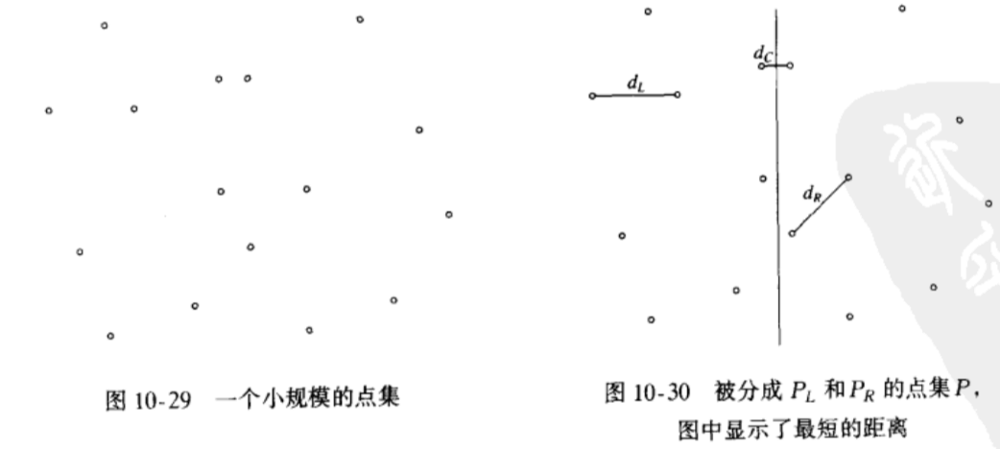

## 算法设计技巧

### 贪婪算法
前面在图论中已经聊到了三种贪婪算法：Dijkstra 算法，Prim 算法和 Kruskal 算法

- **贪婪算法**分阶段地工作，在每一个阶段，可以认为所作决定是好的，而不考虑将来的后果，相当于选择的是某个局部的最优
- 当算法终止时，我们希望局部最优就是全局最优。如果是这样的话，那么算法就是正确的；否则，算法得到的是一个 **次最优解**

#### 贪婪算法的例子

##### 一个简单的调度问题
**问题**：今有作业 j1,j2,...,jN，已知对应的运行时间为 t1,t2,...,tN,而处理器只有一个。为了把作业平均完成的时间最小化？（我们将假设使用 **非预设调度**：一旦开始一个作业，就必须把该作业运行到完成）


如下图，平均完成时间为 25


如下图，平均完成时间未 17.75


第一个作业以 t1 时间完成

第二个作业以 t1 + t2 来完成

第三个作业以 t1 + t2 + t3 来完成

综上，总的代价 

C = (N ∑ 1)(N - K +1) * jk * tk => C = (N + 1)(N ∑ 1) * jk * tk - (N ∑ 1)k * jk * tk

只有第二个求和影响到总开销，因此，为了使 C 最小，我们要保证第 k 次 jk * tk 最小，这就是 **贪婪算法** 中的局部最优解，因此，调度采用单调递减是最优解

*操作系统调度程序一般把高优先级赋予那些更短的作业*

另外，我们把 **单处理器** 切换到 **多处理器** 情况下，如下图


<br/>


解决多处理器情形的算法是按顺序开始作业，处理器之间轮换分配，这存在多个最优解的可能，只要保证 J(ip) 到 J(i(p+1)) 的每一个作业放到不同的处理器上

如下图，是第二个最优解


##### Huffman 编码，文件压缩
**问题**：设我们有一个文件，它只包含字符 a,e,i,s,t,加上一些空格和 newline(换行)。进一步设该文件分别有10个a、15个e、12个i、3个s、4个t、13个空格以及一个 newline，如下图：


如果文件非常大，这种传输是非常消耗资源的

设想，由于每个字符的出现频率是不相同的，如 newline 和 e，我们是否可以根据这个频率设置字符的代码长度，保证经常出现的字符代码长，反之则代码短

我们可以用二叉树表示字母的二进制代码，左代表0，右代表1，如下图：


另外，该树还是一颗 **满树**：所有的节点或者是树叶，或者有两个儿子

如果一个字符放在非树叶节点上，那么可能无法保证字符的唯一性。因此，我们要提高那些频率高的字符的树叶深度，构造一颗总价值最小的满二叉树，如下图：


##### Huffman 算法：
- 每个字符当做一个树，该算法对这些树组成的森林进行
- 一棵树的权等于它的树叶的评率的和
- 任意选取最小权的两棵树 T1 和 T2，并任意形成以 T1 和 T2 为子树的新树
- 将这样的过程进行 C - 1次，最后得到一颗树，该树就是总价值最小的满二叉树

该算法是一个 **贪婪算法**，在每一个阶段我们都进行一次最小权的树的合并而且没有进行全局的考虑

具体的实现我们可以用 **优先队列** 表示这个森林，由于对元素个数不超过 C 的优先队列将进行一次 BuildHeap、2C - 2 次 DeleteMin 和 C - 2 次 Insert，因此运行时间为 O(C logC)

#### 近似装箱问题
**问题**：设给定 N 项物品，大小为 S1,S2,...,Sn,所有的大小满足 0 < Si <= 1。把这些物品装到最小数目的箱子中去

该问题有两个版本：
1. 联机：必须将每一件物品放入一个箱子之后才处理下一个物品
2. 脱机：需要等到所有的输入数据全被读入之后才进行

**联机**

在 **联机** 情况下，不存在最优算法

对于 **联机** 情况，我们有三种 **贪婪算法** 可以解决：

1. 下项适合算法：当处理任何一项物品时，检查看它是否还能装进刚刚装进物品的同一个箱子中去。如果能够装进去，那么就把它放入该箱中；否则，就开辟一个新的箱子
2. 首次适合算法：依次扫描这些箱子并把新的一项物品放入足够盛下它的第一个箱子中。因此，只有当先前放置物品的结果已经没有再容下当前物品余地的时候，才会开辟一个新箱子
3. 最佳适合算法：该法不是把一项新物品放入所发现的第一个能够容纳它的箱子，而是放到所有箱子中能够容纳它的最满的箱子中

**脱机**

可找到最优解

对于 **脱机** 情况下，由于已经知晓了全部物品，我们可以按照递减的顺序排序物品，然后在采用 **首次适合递减算法** 或 **最佳适合递减算法**

### 分治算法

**分治算法** 由两部分组成：
1. **分**：递归解决较小的问题（基础情况除外）（至少两个递归调用）
2. **治**：从子问题的解构构建原问题的解

#### 分治算法的运行时间
对于分治算法，我们课程将每个问题分成若干个子问题，并使用 O(N^K)附加工作

T(N) = aT(N/b) + O(N^K)的时间复杂度为
- O(N^logb a)；若 a > b^k
- O(N^k logN)；若 a = b^k
- O(N^k)；     若 a < b^k

#### 分支算法的例子

##### 最近点问题
**问题**：平面上的点集合P，找出一对最近的点，有可能两个点位于相同的位置，在这种情况下两个就是最近的，它们的距离为 0

如果存在 N 个点，那么就存在 N(N - 1)/2 对点间的距离，我们可以穷举所有的距离，找到最短的距离

我们可以采用 **分治算法**，假设这些点已按 x 坐标排过序，那么我们就可以画一条想象的垂线，把点集分成两半：Pl 和 Pr，最近的一对点或者都在 Pl 中，或者都在 Pr 中，或者一个在 Pl 中而另外一个在 Pr 中，我们分别把这些距离叫做 dl,dr,dc



令 s = min(dl,dr)，如果 dc 对 s 有改进，那么我们只需要计算 dc，如果 dc 是这样的距离，则定义 dc 的两个点必然在分割线的 s 距离之内；我们将把整个区域叫做一条 **带**


有两种方法计算 dc，穷举 位于 **带** 中的点

```c++
for (let i = 0; i < numPointsInstrip; i++) {
  for (let j = i + 1; j < numPointsInstrip; j++) {
    if (dist(pi, pj) < s) {
      s = dist(pi, pj)
    }
  }
}
```

我们可以优化这个算法，设带中的点按照它们的 y坐标 排过序。因此，如果 Pi 和 pj 的 y 坐标相差大于 s ，那么我们跳过这个点直接处理 pi+1

```c++
for (let i = 0; i < numPointsInstrip; i++) {
  for (let j = i + 1; j < numPointsInstrip; j++) {
    // 通过 y 坐标筛选
    if (Math.abs(getYdist(pi) - getYdist(pj)) > s) {
      break
    } else if (dist(pi, pj) < s) {
      s = dist(pi, pj)
    }
  }
}
```

##### 选择问题
**问题**：找出 N 个元素的表 S 中的第 k 个最小的元素

前面的快速选择就是一个 **分治算法** 的例子，这个算法最坏的时间复杂度为 O(N^2)。如果枢纽元选择的过大，因此，枢纽元的选择就变得相当重要，这里提供一种较好的枢纽元选择算法：

1. 把 N 个元素分成 [N / 5] 组，5 个元素一组，忽略（最多 4 个）剩余的元素
2. 找出每组的中项，得到 [N / 5] 个中项的表 M
3. 求出 M 的中项，将其作为枢纽元 v 返回

##### 整数相乘
**问题**：如果要将两个 N 位数 X 和 Y 相乘。X 的每一位数字都要与 Y 的每一位数字相乘，需要 O(N^2) 次操作

如果 X = 61438512 而 Y = 94736407，那么 XY = 5820 464 730 934 047，让我们把 X 和 Y 拆分为两半，分别由最高几位和最低几位数字组成。此时，Xl = 6143，Xr = 8251，Yl = 9473，Yr = 6407。由于得到：
 XY = XlYl * 10^8 + (XlYr + XrYl) * 10^4 + XrYr

通过分治，得到递归： T(N) = 4T / (N / 2) + O(N)

从定理得知 T(N) = O(N^2)，这跟原来一样，因此还需要优化：
XlYr + XrYl = (Xl - Xr)(Yr - Yl) + XlYl + XrYr
 
此时，T(N) = 3T( N / 2 ) + O(N)，从而 T(N) = O(N^1.58),

为了完成这个算法，我们必须要有一个基准情况，该情况无须递归而解决

### 动态规划
某些 **递归算法** 存在着重复性的求解，最终导致低效的算法，此时我们可以提供一种方式，将 **递归算法** 重新写成 **非递归算法**，让后者把那些子问题的答案系统地记录在一个表内。避免重复性地计算。这种方式叫做 **动态规划**

**分值算法** 与 **动态规划** 区别：这些更简单的问题不是原问题的明确的分割

#### 动态规划的例子

##### 用一个表代替递归

```c++
int
fib(int N) {
  if( N <= 1) {
    return 1
  } else {
    return fib(N - 1) + fib(N - 2)
  }
}
```

如上述代码，为了计算 Fn，存在一个对 Fn-1 和 Fn-2的调用，由于 Fn-1 递归地对 Fn-2 和 Fn-3 进行调用，导致 Fn-2 进行了2次，类推，Fn-3 被计算了3次，Fn-4 计算了5次，最终导致算法非常低效

如果能够保留一个预先算出的值而对已解过的子问题不再进行递归调用，那么就可以避免这种低效，如下是改进后的代码：

```c++
fibonacci(int N) {
  int i, last, nextToLast,answer

  if(N <= 1) {
    return 1
  }

  last = nextTolast = 1

  for(i = 2; i <= N; i++) {
    answer = last + nextToLast
    nextToLast = last
    last = answer
  }

  return answer
}
```

第二个例子，代码如下，这个例子中，每一次 sum 都将前面算过 的 sum 又累加了一次，这种增长是指数级的
```c++
eval(int N) {
  int i
  double sum

  if(N == 0) {
    retutn 1.0
  } else {
    sum = 0.0
    for(i = 0; i < N; i++) {
      sum += eval(i);
      return 2.0 * sum / n + n
    }
  }
}
```

同样，我们可以通过 **动态规划** 来优化它，它的运行时间为 O(N)

```c++
eval(int N) {
  int i
  double sum = 0.0
  double last = 1.0

  for(i = 1; i <= N; i++) {
    sum = 2.0 * last / i + i
    last = sum + last
  }
}
```

##### 所有点对最短路径
我们可以用一个短小的算法解决对 **稠密图** 的所有点对的问题，这个算法的运行时间为 O(V^3)，它的循环更紧凑

```c++
allPairs(TwoDimArray a, TwoDimArray d, TwoDimArray path, int n) {
  int i, j, k

  // 初始化 d 和 path
  for (i = 0; i < n; i++) {
    for (j = 0; i < n; j++) {
      d[i][j] = a[i][j]
      path[i][j] = NotAVertex
    }
  }

  // 更新最短路径
  for (k = 0; k < n; k++) {
    for (i = 0; i < n; i++) {
      for (j = 0; j < n; j++) {
        if (d[i][k] + d[k][j] < d[i][j]) {
          d[i][j] = d[i][k] + d[k][j]
          path[i][k] = k
        }
      }
    }
  }
}
```

### 随机化算法
- 在算法期间，随机数至少有一次用于决策。该算法的运行时间不只依赖于特定的输入，而且依赖于所发生的随机数
- 一个随机化算法的最坏情形运行时间几乎总是和非随机化算法的最坏情形运行时间相同
- 重要的区别在于：好的随机化算法没有不好的输入，而只有坏的随机数

#### 随机数发生器
- 由于我们的计算需要随机数，所以我们必须要有一种方式去生成它
- 真正的随机性在计算机上实现是不可能的，因为这些数将依赖于算法，所以我们产生的随机数是 **伪随机数**

产生随机数的最简单的方法师线性同余数发生器，数x1，x2，...的生成满足`Xi+1 = Axi mod M`，为了开始这个序列，必须给出 x0 的某个值，这个值叫做 **种子**，我们选择 M = 2^21 -1 = 2 147 483 647，A = 48 271，每次产生的 X 就是随机数

这个乘法可能会溢出，导致影响计算的结果，从而影响伪随机性，所以，我们需要在加工一下，如下是完整的生成随机数算法：

```c++
static unsigned long seed = 1

#define A 48271L
#define M 2147483647L
#define R (M / A)
#define R (M % A)

random(void) {
  long tmpSeed
  tmpSeed = A * (seed % Q) - R * (seed / Q)
  if(tmpSeed >== 0) {
    seed = tmpSeed
  } else {
    seed = tmpSeed + M
  }

  return seed / M
}
```

#### 随机数的应用
##### 跳跃表
- 我们对链表进行加工，每个 2^i 节点就有一个指针指向下一个 2^i 节点，且节点时排过序的
- 将带有 k 个指针的节点定义为 **k阶节点**，任意 k 阶节点上的第 i 阶 指针指向的下一个节点至少具有 i 阶
- 当插入新元素时，我们随机决定该节点的阶数
- 在查找时由向前到一个新的节点或者在同一节点下降到低一级的指针组成，这种查找叫做 **折半查找**


**Find**
1. 执行 Find 时，在头节点从最高阶的指针开始，沿着这个阶一直走，直至找到大于正在寻找的节点的下一个节点前停下
2. 转到低一阶的阶继续上一步，直到我们位于正在寻找的节点前面，或者未找到该节点

**Insert**
执行一次 **Find** 找到需要插入的节点位置，将新节点插入


注意：跳跃表类似于散列表，它们都需要估计表中的元素个数（从而阶的个数可以确定）

### 回溯算法
- **回溯算法** 是穷举搜索的巧妙实现，但性能一般不理想
- 在进行某些穷举时会在一步内删除一大组可能性，这叫做 **裁剪**
- 我们穷举全部的数据，直到某个条件不满足，返回至又满足的点，继续穷举

#### 回溯算法的应用
##### 收费公路重建问题
设给定 N 个点 P1，P2，P3，...，Pn，他们位于 x 轴上。 xi 是 pi 点的 x 坐标。进一步假设 x1 = 0 以及这些点从左到右给出
这 N 个点确定在每一对点间的 N(N - 1) / 2 个距离，如果给定点集，那么这些距离也可以被排序，**收费公路重建问题** 是从这些距离重新构造一个点集

我们用一个实际问题来分析，设 D = {1, 2, 2, 2, 3, 3, 3, 4, 5, 5, 5, 6, 7, 8, 10},由于 |D| = 15，因此我们知道 N = 6。算法以置 x1 = 0开始，显然 x6 = 10，将 10 剔除

```
-|-------------------------------------|---
x1=10                                 x6 = 10 

D = {1, 2, 2, 2, 3, 3, 3, 4, 5, 5, 5, 6, 7, 8}
```

剩下的距离中最大的是 8， x2 = 2 或者 x5 = 8，由于对称性，它们互为 **镜像**，所以两者对结果是不影响的，所以可以随意选择，我们设 x5 = 8，然后从 D 中剔除距离 x6 - x5 = 2 和 x5 - x1 = 8，得到

```
                                 x5=8
-|---------------------------------|----|---
x1=10                                 x6=10 

D = {1, 2, 2, 3, 3, 3, 4, 5, 5, 5, 6, 7}
```

下一步要么 x4 = 7 或者 x2 = 3，这里存在不确定性：

- x4 = 7，那么 x6 - 7 = 3 和 x5 - 7 = 1 也必须出现在 D 中，满足
- x2 = 3，那么 3 - x2 = 3 和 x5 - 3 = 5 也必须出现在 D 中，满足

这里我们先尝试其中一种是否可以解决问题，如果不行，再回退使用另外的选择，即 **回溯策略**，我们置 x4 = 7，得到：

```
                                  x5=8
-|----------------------------|----|----|---
x1=0                       x4=7       x6=10 

D = {2, 2, 3, 3, 4, 5, 5, 5, 6}
```

现在最大的距离是 6，要么 x3 = 6，要么 X2 = 4
- x3 = 6，x4 - x3 = 1，不满足 D，排除
- x2 = 4, x2 - x0 = 4，x5 - x2 = 4，不满足 D，排除

由于 x4 = 7 不能产生解，我们需要 **回溯**，尝试 x2 = 3

```
    x2=3                         x5=8
-|---|----------------------------|----|---
x1=0                                x6=10 

D = {1, 2, 2, 3, 3, 4, 5, 5, 6}
```

我们再一次在 x4 = 6 和 x3 = 4 之间选择， x3 = 4 不满足 D，所以 x4 = 6，于是得到：

```
    x2=3                         x5=8
-|---|----------------------|-----|----|---
x1=10                     x4=6       x6=10 

D = {1, 2, 3, 5, 5}
```

最后让 x3 = 5，它使得 D 成为空集，因此我们得到问题的一个解

```
    x2=3                         x5=8
-|---|----------|---------|-----|----|---
x1=10         x3=5           x4=6       x6=10 

D = {}
```

实现这个算法的伪代码如下：

```c++
turnpike(int x[], DistSet d, int n) {
  x[1] = 0
  x[n] = deleteMax(d)
  x[n - 1] = deleteMax(d)

  if(x[n] - x[n-1] ¢ d) {
    remove(x[n] - x[n - 1], d)
    // 回溯
    return place(x, d, n, 2, n - 2)
  }
}

place(int x[], DistSet D, int n, int left, int right) {
  int dMax, found = false 

  if(d is Empty) {
    return true
  }

  dMax = findMax(d)

  // 尝试右边
  if(|x[j] - dMax| ¢ d  for all 1<= j < left and right < j <= n) {   
    x[right] = dMax

    for(1 <= j < left, right < j <= n) {
      delete(|x[j| - dMax|, d)
    }

    found = place(x, d, n, left, right - 1)

    if(!found) {
      for(1 <= j < left, right < j <= n) {
        insert(|x[j] - dMax|, d)
      }
    }
  }

  // 尝试左边
  if(!found && |x[n] - dMax -x[j]| ¢ d  for all 1<= j <= left and right < j <= n) {
    x[left] = x[n] - dMax

    for(1 <= j < left, right < j <= n) {
      delete(x[n] = dMax- x[j], d)
    }

    found = place(x, d, n, left + 1, right)

    if(!found) {
      for(1 <= j < left, right < j <= n) {
        insert(|x[n| - dMax - x[j]|, d)
      }
    }
  }

  return found
}
```


 


