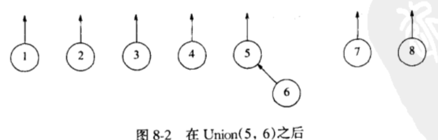
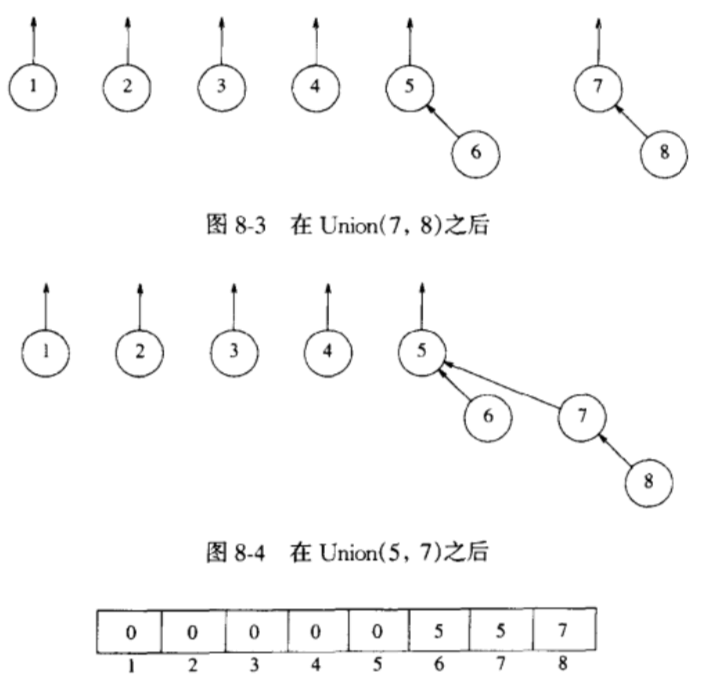

## 并查集

### 等价关系
若对于每一对元素（a，b），a，b ¢ S，aRb 或者为 true 或者为 false，则称在集合 S 上定义关系 R，如果 aRb 是 true，那么我们说 a 与 b 有关系

**等价关系**
1.（自反性）对于所有的 a ¢ S，aRa
2.（对称性）aRb 当且仅当 bRa
3.（传递性）若 aRb 且 bRc 则 aRc

**等价类**
一个元素 a ¢ S 的 **等价类** 是 S 的一个子集，它包含所有与 a 有关系的元素
注意，等价类形成对 S 的一个划分：S的每一个成员恰好出现在一个等价类中
为确定是否 a ~ b，我们只需验证 a 和 b 是否都在同一个等价类中

输入数据最初是 N 个集合的 **类**，每个集合含有一个元素。初始的描述是所有的关系均为 false
每个集合都有一个不同的元素，从而 Si n Sj = 空，这使得这些集合 **不相交**

## Find 和 Union
**并查集** 支持两种运算，**Find** 和 **Union**

**Find**
返回包含给定元素的集合（即等价类）的名字

**Union**
如果我们想要添加关系 a ~ b，那么我们首先要看是否 a 和 b 已经有关系。这可以通过对 a 和 b 执行 Find 并检验它们是否在同一个等价类中来完成
如果它们不在同一个类中，那么我们使用求并运算 Union，这种运算把含有 a 和 b 的两个等价类合并成一个新的等价类
Union 的结果是建立一个新集合 Sk = Si U Sj，去掉原来两个集合而保持所有的集合的不相交性

### 一种实现方式
- 我们们可以在一个数组中保存每个元素的等价类的名字。
- 此时，Find 就是简单的 O（1）查找，假设我们想要执行 Union(a, b)，并设 a 在等价类 i 中而 b 在等价类 j 
- 扫描该数组，将所有的 i 改变成 j，这次扫描要花费 O(N)时间，连续 N - 1 次 Union 操作就要花费 O(N^2) 次时间

### 第二种实现方式
将所有在同一个等价类中的元素放到一个链表中，这在更新的时候会节省时间，因为我们不必搜索整个数组
但是由于它在算法过程中任然可能执行 O(N^2) 次等价类的更新，因此它本身并不能单独减少渐进运行时间

### 第三种实现方式（并查集）
- 使用 **树** 来表示每一个集合，因为树上的每一个元素都有相同的根，这样，该 **根** 就可以用来命名所在的集合
- 开始时每个集合含有一个元素，集合的名字由根处的节点给出（我们将要使用的这些树不一定必须是二叉树，但是表示它们要容易，因为我们需要的唯一信息就是一个父指针）
- 由于只需要父节点的名字，因此可以假设树被非显式地存储在一个数组中，数组的每个成员 P[i] 表示元素 i 的父亲，如果 i 是根，那么 P[i] = 0

如图，是一个未进行 Find 和 Union 的并查集

为了执行两个集合的 Union 运算，我们使一个节点的根指针指向另一棵树的根节点。显然，这种操作花费常数时间


<br/>

<br/>

<br/>


对元素 X 的一次 Find(X) 操作通过返回包含 X 的树的根而完成，执行这次操作花费的时间与表示 X 的节点的深度成正比

实现：

```c++
initialize(DisjSet s) {
  int i
  for (i = NumSets; i > 0; i--) {
    S[i] = 0
  }
}

setUnion(DisjSet s, setType root1, setType root2) {
  s[root2] = root1
}

find(ElementType x, DisjSet s) {
  if (s[x] <= 0) {
    return x
  } else {
    return find(s[x], s)
  }
}
```

### 灵巧求并（优化 union）

#### 按大小合并
总让较小的树成为较大的树的子树

节点初始处于深度 0 的位置。当它的深度随着一次 Union 的结果而增加的时候，该节点则被置于至少是它以前所在树两倍大的一棵树上。因此，它的深度最多可以增加 log N 次，Find 操作的运行时间使 O(log N)，而连续 M 次操作则花费 O(M log N)


**实现**：
- 由于我们实际上只使用一个数组，因此可以让每个根的数组元素包含它的树的大小的负值。这样一来，初始时树的数组表示就都是 -1 
- 当执行一次 Union 时，要检查树的大小，新的大小是老的大小的和

#### 按高度求并
- 与 **大小合并** 不同，我们跟踪每棵树的高度而不是大小并执行那些 Union 使得浅的树成为深的树的子树
- 只有当两棵树相等深度时求并才会使树的高度增加

```c++
setUnion(DisjSet s, SetType root1, SetType root2) {
  if(s[root2] < s[root1]) {
    s[root1] = s[root2]
  } else if(s[root1] == s[root2]) {
    s[root1]--
    s[root2] = root1
  }
}
```


<br />

<br />

<br />

### 路径压缩（优化 find）
在一次 Find 操作期间执行而与用来执行 union 的方法无关

设操作为 Find(X)，此时路径压缩的效果是，从 X 到根的路径上的每一个节点都使它的父节点变成根
路径压缩的实施在于使用额外的两次指针移动

下图是对树执行 Find(15)后压缩路径的效果


<br />


```c++
find(ElementType x, DisjSet s) {
  if (s[x] <= 0) {
    return x
  } else {
    return s[x] = find(s[x], s)
  }
}
```

**路径压缩** 与 **灵巧求并** 结合在所有情况下都将产生非常有效的算法

注意，**路径压缩** 与**按高度求并** 不完全兼容，因为路径压缩可以改变树的高度


