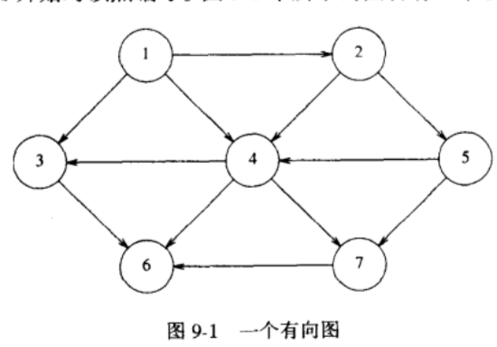
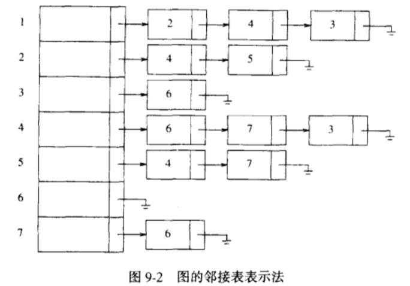

## 图论算法

### 定义
- 图（grpah）：G = (V，E) 由 **顶点** 集 V 和 **边**集 E 组成
- 边（edge）：有时也把边称做 **弧（arc）**，每一条边就是一个点对（v，w）
- 有向图：如果点对是 **有序** 的，那么图就是有向图
- 邻接：当且仅当（v，w）¢ E。在一个具有边（v，w）从而具有边（w， v）的无向图中，w 和 v **邻接** 且 v 也和 w **邻接**
- 权：**边** 具有的第三种成分，也称作 **值**

- 路径：一个顶点序列 w1,w2,w3,...,wN，使得 (w1，wi+1)¢E，1 <= i < N
- 路径的长：该路径上的边数，它等于 N - 1，从一个顶点到它自身可以看成是一条路径；如果路径不包含边，那么路径的长为 0
- 环：如果图含有一条从一个顶点到它自身的边（v，v），那么路径 v，v叫做环
- 简单路径：其上的所有顶点都是互异的，但第一个顶点和最后一个顶点可能相同

- 有向图的圈：满足 w1 = wN 且长至少为 1 的一条路径；如果该路径是简单路径，那么这个圈就是简单圈
- 无向图的圈：在 **有向图的圈** 的基础上要求边是互异的
- 无圈图：一个有向图没有圈，也称为 DAG

- 无向图的连通：如果一个无向图中从每一个顶点到其他每个顶点都存在一条路径，则称该无向图是 **连通的**
- 基础图：有向图的 **边** 上去掉方向所形成的图
- 强连通：如果一个有向图满足 **连通性**，则称为 **强连通**
- 弱连通：如果一个有向图不是 **强连通**，但是它 **基础图** 是连通的，称为 **弱连通**
- 完全图：每一对顶点间都存在一条边的图

### 图的表示

#### **邻接矩阵** （适用于稠密的图）
1. 使用一个二维数组来表示图，对于每条边（u，v），我们置 A[u][v] = 1；否则，数组的元素就是 0
2. 如果边有一个权，我们可以置 A[u][v] 等于该权，使用一个很大或者很小的权作为标记表示不存在的边

*这种表示非常简单，但是，它的空间需求为 V^2，如果图的边不是很多，这种表示对空间的浪费太大*

#### **邻接表**（适用于稀疏的图）
- 对每一个顶点，我们使用一个数组来存储
- 我们使用另外一个表来存放所有它的邻接顶点，此时的空间需求为 E+V
- 如果边有权，那么这个附加的信息也可以存储在单元中

对于无向图，每条边（u，v）都出现在两个表中，因此空间的使用基本上是双倍的
获取某个给定顶点 v 邻接的所有顶点也很简单，扫描相应的邻接表来完成

*在实际情况下顶点都有名字而不是数字，由于我们不能通过未知名字为一个数组做索引，所以需要一个散列表将名字转化为 1-V 之间的内部编号，这些编号在图被读入的时候指定，最终输出顶点名字时，再通过编号转回顶点名字，（可以通过保留一个指向散列表内的指针数组）*

表示如图：

<br />


### 拓扑排序
- 对 **有向无圈图** 的顶点的一种排序，它使得如果存在一条从 vi 到 vj 的路径，那么在排序中 vj 出现在 vi 的后面
- 排序不必是唯一的，任何合理的排序都是可以的，对于上面的有向图，v1,v2,v5,v4,v3,v7,v6 和 v1,v2,v5,v4,v7,v3,v6都是拓扑排序 

- 先找出任意一个没有入边的顶点，显示出该顶点，将它和它的边一起从图中删除
- 对图的其余部分应用同样的方法处理

入度：边（u，v）的条数

以下为伪代码：

```c++
topSort(Graph G) {
  int Counter
  Vertex v,w

  for(counter = 0; counter < numVertex; couter++) {
    // 扫描 Indegree[],寻找一个尚未被分配拓扑编号的入度为 0 的顶点
    v = findNewVertexOfIndegreeZero()

    if(v == NotAVertex) {
      Error('Graph has a cycle')
      break
    }

    TopNum[v] = counter
    for each w adjacent to v
      indegree[w]--
  }
}
```
每次 findNewVertexOfIndegreeZero 都对整个 indegree 数组进行了一次扫描，每次就是 O(V)时间，由于有 V 次这样的调用，因此该算法的运行时间为 O(V^2)

如果图是稀疏的，每次迭代期间只有一些顶点的入度被更新，但是在执行 findNewVertexOfIndegreeZero 时还是扫描了全部顶点

对于 **稀疏图**，我们采取另一种方式：

- 使用一个栈或者队列，首先，对每一个顶点计算它的入度
- 将所有入度为 0 的顶点放入一个初始为空的队列中
- 当队列不空时，删除一个顶点 v，并将与 v 邻接的所有的顶点的入度减 1
- 只要一个顶点的入度降为 0，就把该顶点放入队列中

如果我们通过使用扫描表来找出最小 dist，那么每一步将花费 O(V) 时间找到最小值，从而整个算法需要 O(V^2)时间查找最小 dist

如果图是**稀疏**的，这种算法会很慢，因此这里我们不采用队列，而是使用堆
将 dist 存储到堆中，通过一个 deleteMin 来找到最小值，更新也采用 DecreateKey 来操作，这时查找最小值的时间为 O(log V)，总的运行时间为 O(E logV)

*注意，由于堆不能有效地支持 Find 操作，因此 dist 的每个值在堆中的位置将需要保留并当 dist 在优先队列中改变时更新*

#### 具有负边值的图
对于负值边，我们结合 **赋权** 和 **无权** 的算法结合起来，并抛弃关于已知的顶点的概念

```c++
weightdNegative(Table T) {
  Queue q
  Vertex v, w

  q = createQueue(numVertex)
  makeEmpty(q)

  while(!isEmpty(q)) {
    v = dequeue(q)

    for each w adjacent to v
    if(t[v].dist + c < t[w].dist) {
      t[w].dist = t[v].dist + c
      t[w].path = v

      if(w is not alerady in Q) {
        enqueue(w, q)
      }
    }
  }
}
```

*注意，如果没有负值圈，该算法能够正常工作，但是，每个顶点最多可以出队 V 次，因此，如果使用邻接表则运行时间使 O(EV)*
*如果负值圈存在，那么所写的算法将无限循环下去。通过在任一顶点已经出队 V+1 次后停止算法运行，我们可以保证算法能终止*