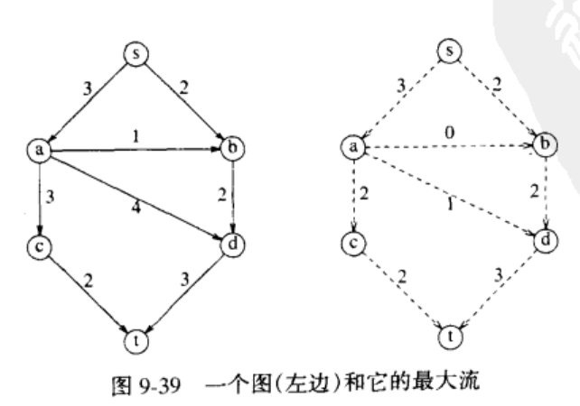
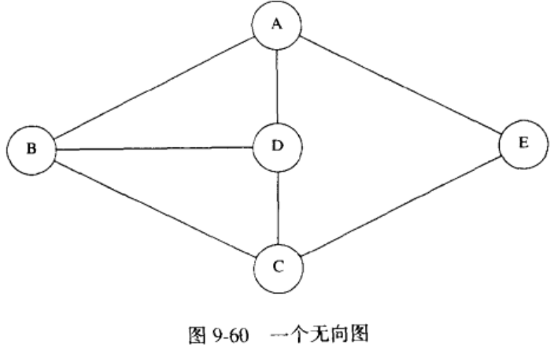
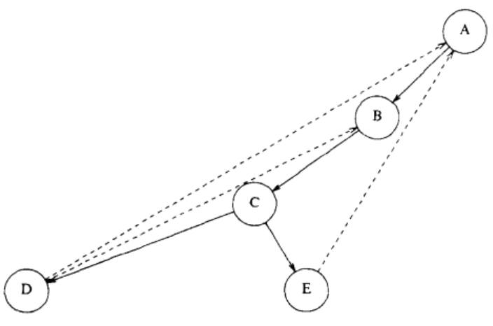
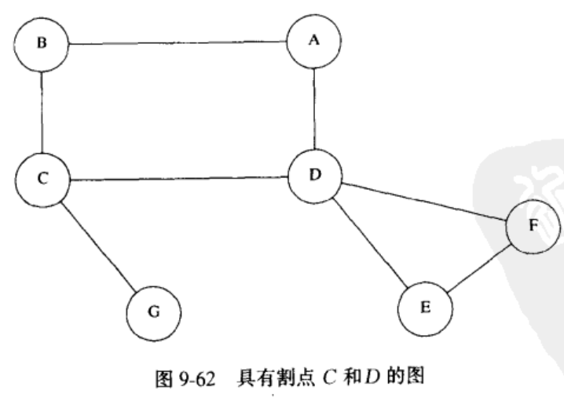
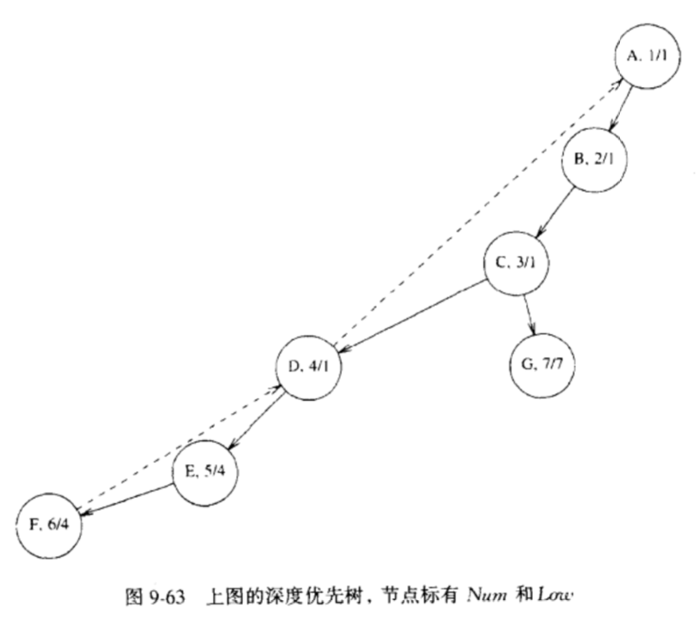
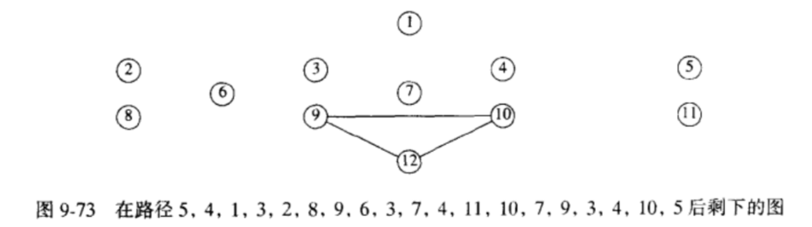
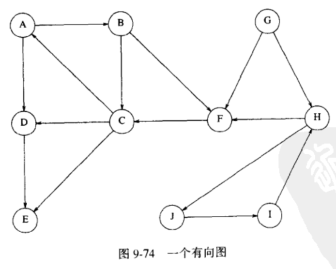
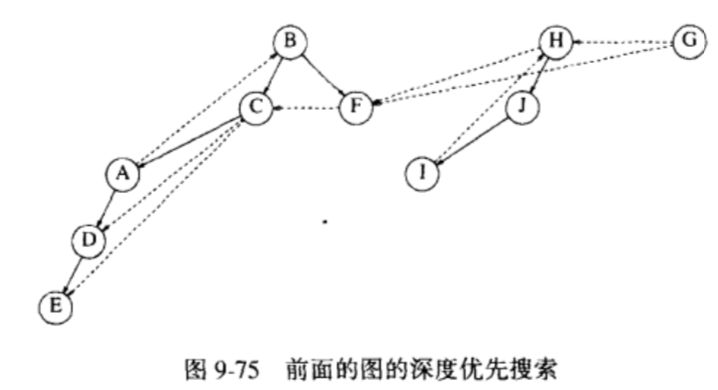
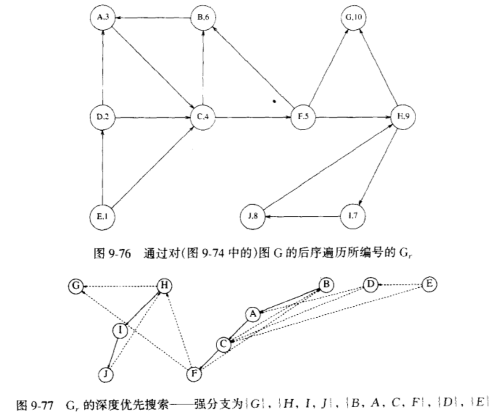

## 图论算法

### 定义
- 图（grpah）：G = (V，E) 由 **顶点** 集 V 和 **边**集 E 组成
- 边（edge）：有时也把边称做 **弧（arc）**，每一条边就是一个点对（v，w）
- 有向图：如果点对是 **有序** 的，那么图就是有向图
- 邻接：当且仅当（v，w）¢ E。在一个具有边（v，w）从而具有边（w， v）的无向图中，w 和 v **邻接** 且 v 也和 w **邻接**
- 权：**边** 具有的第三种成分，也称作 **值**

- 路径：一个顶点序列 w1,w2,w3,...,wN，使得 (w1，wi+1)¢E，1 <= i < N
- 路径的长：该路径上的边数，它等于 N - 1，从一个顶点到它自身可以看成是一条路径；如果路径不包含边，那么路径的长为 0
- 环：如果图含有一条从一个顶点到它自身的边（v，v），那么路径 v，v叫做环
- 简单路径：其上的所有顶点都是互异的，但第一个顶点和最后一个顶点可能相同

- 有向图的圈：满足 w1 = wN 且长至少为 1 的一条路径；如果该路径是简单路径，那么这个圈就是简单圈
- 无向图的圈：在 **有向图的圈** 的基础上要求边是互异的
- 无圈图：一个有向图没有圈，也称为 DAG

- 无向图的连通：如果一个无向图中从每一个顶点到其他每个顶点都存在一条路径，则称该无向图是 **连通的**
- 基础图：有向图的 **边** 上去掉方向所形成的图
- 强连通：如果一个有向图满足 **连通性**，则称为 **强连通**
- 弱连通：如果一个有向图不是 **强连通**，但是它 **基础图** 是连通的，称为 **弱连通**
- 完全图：每一对顶点间都存在一条边的图

### 图的表示

#### **邻接矩阵** （适用于稠密的图）
1. 使用一个二维数组来表示图，对于每条边（u，v），我们置 A[u][v] = 1；否则，数组的元素就是 0
2. 如果边有一个权，我们可以置 A[u][v] 等于该权，使用一个很大或者很小的权作为标记表示不存在的边

*这种表示非常简单，但是，它的空间需求为 V^2，如果图的边不是很多，这种表示对空间的浪费太大*

#### **邻接表**（适用于稀疏的图）
- 对每一个顶点，我们使用一个数组来存储
- 我们使用另外一个表来存放所有它的邻接顶点，此时的空间需求为 E+V
- 如果边有权，那么这个附加的信息也可以存储在单元中

对于无向图，每条边（u，v）都出现在两个表中，因此空间的使用基本上是双倍的
获取某个给定顶点 v 邻接的所有顶点也很简单，扫描相应的邻接表来完成

*在实际情况下顶点都有名字而不是数字，由于我们不能通过未知名字为一个数组做索引，所以需要一个散列表将名字转化为 1-V 之间的内部编号，这些编号在图被读入的时候指定，最终输出顶点名字时，再通过编号转回顶点名字，（可以通过保留一个指向散列表内的指针数组）*

表示如图：

<br />


### 拓扑排序
- 对 **有向无圈图** 的顶点的一种排序，它使得如果存在一条从 vi 到 vj 的路径，那么在排序中 vj 出现在 vi 的后面

- 排序不必是唯一的，任何合理的排序都是可以的，对于上面的有向图，v1,v2,v5,v4,v3,v7,v6 和 v1,v2,v5,v4,v7,v3,v6都是拓扑排序 

- 先找出任意一个没有入边的顶点，显示出该顶点，将它和它的边一起从图中删除
- 对图的其余部分应用同样的方法处理

入度：边（u，v）的条数

以下为伪代码：

```c++
topSort(Graph G) {
  int Counter
  Vertex v,w

  for(counter = 0; counter < numVertex; couter++) {
    // 扫描 Indegree[],寻找一个尚未被分配拓扑编号的入度为 0 的顶点
    v = findNewVertexOfIndegreeZero()

    if(v == NotAVertex) {
      Error('Graph has a cycle')
      break
    }

    TopNum[v] = counter
    for each w adjacent to v
      indegree[w]--
  }
}
```

每次 findNewVertexOfIndegreeZero 都对整个 indegree 数组进行了一次扫描，每次就是 O(V)时间，由于有 V 次这样的调用，因此该算法的运行时间为 O(V^2)

如果图是稀疏的，每次迭代期间只有一些顶点的入度被更新，但是在执行 findNewVertexOfIndegreeZero 时还是扫描了全部顶点

对于 **稀疏图**，我们采取另一种方式：

- 使用一个栈或者对队列，对每一个顶点计算它的入度
- 将所有入度为 0 的顶点放入一个初始为空的队列中
- 当队列不为空时，删除一个顶点 v，并将与 v 邻接的所有的顶点的入度减 1
- 只要一个顶点的入度降为 0，就把该顶点放入队列中
- 拓扑排序就是顶点出队的顺序

```c++
topSort(Graph G) {
  Queue q
  int counter = 0
  Vertex v,w

  // 创建入度队列
  q = createQueue(numVertex)
  makeEmpty(q)

  for each vertex v
    // 将所有入度为 0 的顶点放入一个初始为空的队列中
    if(indegree[v] == 0) {
      enqueue(v, q)
    }

  while(!isEmpty(q)) {
    v = dequeue(q)
    topNum[v] = ++counter

    for each w adjacent to v
      if(--indegree[w] == 0) {
        enqueue(w, q)
      }
  }

  if(counter != numVertex) {
    Error('Graph has a cycle')
  }

 // 释放队列内存
  disposequeue(q)
}
```

*采用这种方式，执行这个算法所用的时间为 O(E + V)*

### 最短路径算法
**赋权路径长**：与每条边（vi，vj）相联系的是穿越该边的代价ci,j，一条路径 v1,v2...vn 的值是 c1+c2+...+cn
**无权路径长**：不包括边的值，只是路径上的边数

#### 单源最短路径问题
给定一个赋权图 G = (V, E) 和一个特定顶点 s 作为输入，找出从 s 到 G 中每一个其他顶点的最短赋权路径

该问题我们讨论4种类型：
1. 无权最短路径问题
2. 无负边，赋权最短路径问题
3. 有负边，赋权最短路径问题
4. 以线性时间解决无圈图的赋权最短路径问题

#### 无权最短路径
如图是一个无权有向图：


1. 我们选择 v3 作为起点，先找出与 s 距离为 1 的顶点，为 v1 和 v6
2. 找出与 s 距离为 2 的顶点，即邻接到 v1 和 v6 的顶点，为 v2 和 v4 
3. 找出与 s 距离为 3 的顶点，v5，v7，此时所有的顶点都已扫描到

**广度优先搜索**：按层处理顶点：距开始点最近的那些顶点首先被赋值，而最远的那些顶点最后被赋值

我们采用一张表，记录每个顶点的3个变量
- dist：从 s 到顶点的距离
- known: 未被处理过的顶点为 0 ，处理后的顶点为 1
- path

当一个顶点被标记为已知时，我们就确信不会再找到更短的路径，因此对该顶点的处理实质上已经完成，以下是一种实现方式

```c++
unweighted(Table t) {
  int currDist
  Vertex v, w

  for(currDist = 0; currDist < numVertex; currDist++) {
    for each vertex v
      if(!t[v].known && t[v].dist == currDist) {
        for each w adjacent to v
          if(t[w].dist == Infinity) {
            t[w].dist = currDist + 1
            t[w].path = v
          }
    } 
  }
}
```

由于双层嵌套 for 循环，因此运行时间为 O(V^2)，虽然顶点被 known 了，但是外层循环还是要继续，因此，我们可以采用一种类似于拓扑排序的做法来排除这种低效性

同样，我们采用一个队列：
- 迭代开始的时候，队列只含有距离为 currDist 的那些顶点
- 当我们添加距离为 currDist + 1 的那些邻接顶点时，由于它们自队尾入队，因此这就保证它们直到所有距离为 currDist 的顶点被处理之后才被处理
- 在距离为 currDist 的最后一个顶点出队处理后，队列只含有距离为 currDist + 1 的顶点，重复这个过程

由于一个顶点被处理后就不会再进入队列，所以 known 字段可以删除

```c++
unweighted(Table t) {
  Queue q
  Vertex v,w

  // 将初始顶点插入队列
  enqueue(s, q)

  while(!isEmpty(q)) {
    v = dequeue(q)

    for each w adjacent to v 
      if(t[w].dist = infinity) {
        t[w].dist = t[v].dist + 1
        t[w].path = v
        
        enqueue(w, q)
      }
  }
  disposeQueue(q)
}
```

### 赋权最短路径（Diijkstra 算法）
类似于无权最短路径，我们保留 known,dist,path 3个属性，
- known：是否处理过
- dist： 使用已知顶点作为中间顶点从 s 到 v 的最短路径的长
- path：引起 dist 变化的最后的顶点

**贪婪算法**：一般分阶段求解一个问题，在每个阶段它都把当前出现的当作是最好的去处理

- diijKstra 算法像无权最短路径算法一样，按阶段进行
- 在每个阶段，算法选择一个顶点 v，它在所有未知顶点中具有最小的 dist，并声明从 s 到 v 的最短路径是已知的
- 阶段的其余部分由 dist 的更新组成，若顶点 v 能提供一条更短路径，则我们本质减低了 dist 的值，那我们就更新 dist

如图：


<br/>


如果我们通过使用扫描表来找出最小 dist，那么每一步将花费 O(V) 时间找到最小值，从而整个算法需要 O(V^2)时间查找最小 dist

如果图是 **稀疏** 的，这种算法会很慢，因此这里我们不采用队列，而是使用堆

将 dist 存储到堆中，通过一个 deleteMin 来找到最小值，更新也采用 DecreateKey 来操作，这时查找最小值的时间为 O(log V)，总的运行时间为 O(E logV)

```c++
// 表初始化例程
initTable(Vertex start, graph g, Table t) {
  int i
  readGraph(g, t)

  for(i = 0; i < numVertex; i++) {
    t[i].known = false 
    t[i].dist = Infinity
    t[i].path = notAVertex
  }
  t[start].dist = 0
}

// 显示实际最短路径
printPath(Vertex v, table t) {
  if(t[v].path != notAVertex) {
    printPath(t[v].path, t)
    printf('to')
  }
  printf('%v', v)
}

// dijkstra 算法
dijkstra(Table t) {
  Vertex v, w

  for( ; ; ) {
    // 通过 deleteMin 找到最小 dist 顶点
    v = smallest unknown distance vertex

    if(v == notAVertex) {
      break
    }

    t[v].known = true

    // 堆不支持 find，所以这里很难办
    for each w adjacent to v
      if(!t[w].known) {
        if(t[v].dist + c < t[w].dist) {
          decrease(t[w].dist to t[v].dist +c)
          t[w].path = v
        }
      }
  }
}
```

*注意，由于堆不能有效地支持 Find 操作，因此 dist 的每个值在堆中的位置将需要保留并当 dist 在优先队列中改变时更新*

#### 具有负边值的图
对于负值边，我们结合 **赋权** 和 **无权** 的算法结合起来，并抛弃关于已知的顶点的概念

```c++
weightdNegative(Table T) {
  Queue q
  Vertex v, w

  q = createQueue(numVertex)
  makeEmpty(q)

  while(!isEmpty(q)) {
    v = dequeue(q)

    for each w adjacent to v
    if(t[v].dist + c < t[w].dist) {
      t[w].dist = t[v].dist + c
      t[w].path = v

      if(w is not alerady in Q) {
        enqueue(w, q)
      }
    }
  }
}
```

*注意，如果没有负值圈，该算法能够正常工作，但是，每个顶点最多可以出队 V 次，因此，如果使用邻接表则运行时间使 O(EV)*
*如果负值圈存在，那么所写的算法将无限循环下去。通过在任一顶点已经出队 V+1 次后停止算法运行，我们可以保证算法能终止*

#### 无圈图
对于无圈图，我们可以以 **拓扑顺序** 来选择顶点。由于选择和更新可以在拓扑排序执行的时候进行，当一个顶点 v 被选择之后，它的 **入度** 为 0，所以它的 dist 不可能再被减低，因此算法能够一趟完成

这种算法的运行时间为 O(E + V)

##### 关键路径分析分析法
下图是一个 **动作节点图**，图中的边代表优先关系：我们假设不相互依赖的动作可以并行


该图可以用来模拟方案的构建，我们可以通过无圈图的算法处理几个问题

1. 整个方案执行完的最早完成时间(即所有节点执行完的最小时间)
2. 哪些动作可以延迟，延迟多长，而不至于影响最少完成时间

为了进行这些运算，首先我们把 **动作节点图** 转化为 **事件节点图**（将节点的耗时转换为赋权边），每个事件对应一个动作和所有与它相关的动作的完成


对于第一个问题，我们可以找到上图的最长路径，由于是无圈图，所以是可以找到的，类似于 dijkstra 算法，判断 dist 从最小值转换为最大值


```
EC1 = 0
ECw = max(ECw + c) // （v, w）¢ E
```

对于第二个问题，我们可以计算能够完成而不影响最后完成时间的最晚时间 LCi


```
LCn = ECn
LCv = min(LCw - c)  // （v, w）¢ E
```


最晚完成时间 - 最早完成时间即延迟时间

**关键路径**：延迟时间为 0 的路径

### 网络流问题
- 设给定边容量为 Cv,w 的有向图 G = (V, E)
- 有两个顶点，一个是 s，称为 **发点**，一个是 t，称为 **收点**
- 对于任一条边 (v, w)，最多有“流”的 Cv,w 个单位可以通过
- 在既不是发点 s 又不是收点 t 的任一顶点 v，总的进入的流必须等于总的发出的流
- 最大流问题就是确定从 s 到 t 可以通过的最大流量

如图，最大流是 5



#### 解决方法
我们需要另外两个图，Gf,Gr
- Gf：表示在算法的任意阶段已经达到的流，开始时 Gf 的所有边都没有流，终止时 Gf包含最大流
- Gr：表示对于每条边还能再添加上多少流，一旦注满一条边，则这条边就要从图中除去

通过不断地调整 Gf，Gr，我们可以获取整个最大流，流程如下：


<br />


<br />


<br />


若选择另外一条路径，很可能就不会再找到最优解，这是上述算法的问题所在：


为了使得算法有效，我们需要让算法改变它的意向，**可以通过相反的方向发回一个流而使算法改变它的意向**，以下是例图：


<br/>


<br/>

如果边的容易都是有理数，那么该算法总以最大流结束

#### 最小生成树
对于一个 **无向连通图** G，由该图的那些连接 G 的所有顶点的边构成的树，且其总价值最低


#### 思路
- 在最小生成树中边的条数为 V - 1，最小生成树是一棵树，因为它无圈
- 对于任一生成树 T，如果将一条不属于 T 的边 e 添加进来，则产生一个圈。如果从该圈中除去任意一条边，则又恢复生成树的特性
- 如果边 e 的值比除去边的值低，那么新生成的树的值就比原生成树的值低
- 如果在建立生成树时所添加的边在所有避免成圈的边中值最小，那么最后得到的生成树的值不能再改进，此时的树就是最小生成树

基于上面的思路，有两种算法：
1. Prim 算法
2. Kruskal 算法

#### Prim 算法
Prim 算法与求最短路径的 Dijkstra 算法相同，只不过 dist 是连接 v 到已知顶点的最短边的权

同 Dijkstra，对于稠密的图使用表，时间复杂度为 O(V^2)，对于稀疏的图用堆 O(E logV)


#### Kruskal 算法
这种贪婪策略是连续地按照最小的权选择边，并且当所选的边不产生圈就把它作为取定的边

就像处理一个森林，开始的时候存在 V 棵单节点数，而添加一边则将两棵树合并成一棵树，当算法终止的时候，就只有一棵树了，这棵树就是最小生成树


我们可以通过一个 **并查集** 实现这个策略

- 每个顶点最初是在它自己的集合中
- 如果 u 和 v 在同一个集合中，那么连接它们的边就要放弃,因为这代表它们已经连通，形成了一个圈
- 如果两个顶点不在同一个集合中，则将该边加入，并对包含顶点 u 和 v 的这两个集合实施一次合并 

**注意，该策略可能存在测试所有边的情况，如将某条边的值设为 100，那么所有的边就会考察到，所以我们采用指向边的指针数组，为重新排列堆，只需要移动指针就好**

```c++
kruskal(Graph g) {
  int edgesAccepted
  Disjset S
  PriorityQueue H
  Vertex u,v
  SetType uset，vset
  Edge e

  // 初始化并查集
  initialize(s)
  // 读取各边数据，放入队列中
  readGraphIntoHeapArray(g, h)
  // 构建堆
  buildHeap(h)

  edgesAccepted = 0

  while(edgesAccepted < numVertex - 1) {
    e = deleteMin(h)

    // e= E(u, v)
    uset = find(u,s)
    vset = find(v,s)

    if(uset != vset) {
      edgesAccepted++
      setUnion(s, uset, vset)
    }
  }
}
```

该算法的最坏情形运行时间为 O(E logE)，由于 E = O(V^2)，因此这个运行时间实际上是 O(E logV)

### 深度优先搜索（Dfs）的应用

**深度优先搜索** 是对 **先序遍历** 的推广，我们从某个顶点 v 开始处理 v，然后递归地遍历所有与 v 邻接的顶点

当访问一个顶点 v 的时候，由于我们已经到了该点处，因此可以标记该点是访问过的，并且对于尚未被标记的所有邻接顶点递归调用深度优先搜索

*对于无向图，每条边(v, w) 在邻接表中出现两次：一次是 (v, w)，另一次是（w, v）*

```c++
  dfs(Vertex v) {
    for each w adjacent to v
    if(! visited[w]) {
      dfs(w)
    }
  }
```

如果图是无向的且不连通，或是有向的但非强连通，这种方法可能会访问不到某些节点，此时，我们搜索一个未被标记的节点，然后对其使用 dfs(v)，并继续这个过程直到不存在未标记的节点为止

因为该方法保证每一条边只访问一次，所以总的时间是 O(E + V)

#### 无向图
我们对如下的一个无向图进行 dfs



经过 dfs 后，会生成一个 **深度优先生成树**，如果图不是连通的，还会生成 **深度优先生成森林**



- 该树的根是A，是第一个被访问到的顶点
- 图中的每一条边 (v, w) 都出现在树上。如果当我们处理(v, w) 时发现 w 是未被标记的，或当我们处理(w, v)时发现 v 是未标记的，那么我们就用树的一条边表示它
- 如果我们处理(v, w)时发现 w 已被标记，并且当我们处理(w, v)时发现 v 也已有标记，那么我们就画一条虚线，称为 **背向边**

#### 双连通性
**双连通性**：如果一个连通的无向图中的任一顶点删除之后，剩下的图仍然连通，那么这样的无向连通图称为 **双连通的**

**割点**：如果一个图不是双连通的，那么，将其删除后图将不再连通的顶点叫做割点

如图，C 和 D 就是割点



深度优先搜索提供了一种找出联通图中的所有割点的线性时间算法



**Num(v)**：执行深度优先搜索并在顶点被访问时的编号
**Low(v)**：当前顶点通过树的零条或者多条边切可能还有一条背向边而能达到的编号最低的顶点

我们可以通过对 **深度优先生成树** 执行一次后续遍历有效地算出 Low，根据 Low 的定义可知 Low(v) 是：
1. Num(v)
2. 所有背向边 (v, w) 中的最低 Num(w)
3. 树的所有边 (v, w) 中的最低 Low(w)

当确定所有信息后，我们就可以找到割点。
- 对于根，当且仅当它有多于一个的儿子时，才是割点
- 对于任何其他顶点 v，它是割点当且仅当它有某个儿子 w 使得 Low(w)>= Num(v)

下面是实现的代码，这里忽略对根的容易实现的测试

```c++
findArt(Vertex v) {
  Vertex w

  Visited[v] = true

  // 规则1
  Low[v] = Num[v] = Counter++ 

  for each w adjacent to v {
    if(!Visited[w]) { 
      Parent[w] = v
      findArt(w)

      if(Low[w] >= Num[v])  {
        printf('%v 是个割点', v)
      }

      // 规则3
      Low[v] = min(Low[v], Low[w])
    }
  } else if(Parent[v] != w){
    // 背向边，规则2
    Low(v) = min(Low[v], Num[w])
  }
}
```

#### 欧拉回路
**欧拉回路**：对于一个图，有一个圈，该圈恰好经过每条边一次

要满足欧拉回路，有两个条件：
1. 图是连通的
2. 每个顶点的度是偶数

一个顶点有边进入，则必然有边离开。如果任一顶点 v 的度为奇数，那么进入 v 点后，将没其他边可以出来。如果恰好有两个顶点的度是奇数，那么当我们从一个奇数触发后，最后终止在另一个奇数度的顶点时，得到的是一个 **欧拉环游**，如果奇数度的顶点多于两个，那么欧拉环游也是不可能存在的

我们可以执行一次 **深度优先搜索**找到欧拉回路

- 从起点开始遍历，如果从起点出发的所有边均已用完，那么图中就会有的部分遍历不到
- 找出有尚未访问的边的路径上的第一个顶点，并执行另外一次深度优先搜索，这将获得另外一个回路，把它拼接到原来的回路上
- 循环上个过程直到所有的边都被遍历到为止

如图：


<br/>

<br/>


该 **深度优先生成森林** 中，有三种类型的边不通向新的顶点
- 背向边 (a, b) 和 (i, h)
- 前向边 (c, d) 和 (c, e)
- 交叉边 (f, c) 和 (g, f)

*注意，深度优先搜索森林一般通过把一些子节点和一些新的树从左到右添加到新的森林中形成。在以这种方式构成的有向图的深度优先搜索中，交叉边总是从右到左的*

为使算法有效，必须使用适当的数据结构：
- 为使拼接简单，应该把路径作为一个链表保留
- 为避免重复扫描邻接表，对于每一个邻接表必须保留一个指向最后扫描到的边的指针
- 当拼接进一个路径是，必须从拼接点开始搜索新顶点，从这个新顶点进行下一轮深度优先搜索

该算法的时间复杂度为 O(E + V)

#### 有向图
有向图的深度优先搜索思路与无向图相同，它有几种用途：
1. 检测一个有向图是否是无圈图，法则如下：一个有向图是无圈图当且仅当它没有背向边
2. 当一个有向图是无圈图时，我们可以通过 **深度优先生成森林** 的后续遍历给顶点指定拓扑编号 N,N-1,...,1来进行 **拓扑排序**


<br/>


#### 查找强分支
通过执行两次深度优先搜索，我们可以检测一个有向图是否是强连通的，如果它不是强连通的，那么实际上可以得到顶点的一些子集，他们到其自身是强连通的



- 在输入的图 G 上执行一次深度优先搜索，通过对深度优先搜索的后序遍历将 G 的顶点编号，然后再把 G 的所有边反向，形成 Gr
- 对 Gr 再执行一次深度优先搜索，总是在编号最高的顶点开始一次新的深度优先搜索
- 在该 **深度优先生成森林** 的每棵树形成一个强连通的分支


