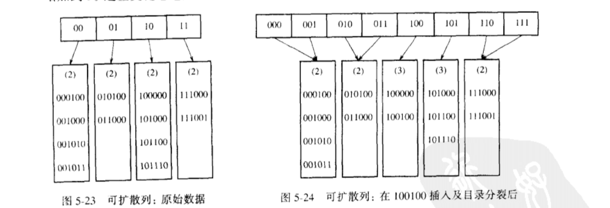

### 散列
- 散列是一种用于以常熟平均时间执行插入、删除和查找的ADT
- 但是，那些需要元素间任何排序信息的操作将不会得到有效的支持

### 散列的实现
- 理想的散列表数据结构只不过是一个包含有关键字的具有固定大小的数组
- 一个关键字就是一个带有相关值的字符串。我们把表的大小记作 TableSize
- 每个关键字被映射到从 0 到 TableSize 这个范围中的某个数，并且被放到适当的单元中，这个映射叫做 **散列函数**，理想情况下它应该运算简单并且应该保证任何两个不同的单元

### 冲突
由于单元的数目是有限的，而关键字实际上是用不完的，如果两个关键字散列到同一个值，这种情况叫做冲突

### 散列函数
1. 如果输入的关键字是整数，则一般合理的方法是直接返回 `key mod tableSize` 的结果，为了介绍的冲突，好的办法通常是 **保证表的大小是素数**
2. 如果输入的关键字是字符串，一般会转化其成 ASCII 码，然后根据 ASCII 码在选择一种散列函数进行转换

### 解决冲突的方法

#### 分离连接法
将散列到同一个值的所有元素保留到一个表中。表的实现可以采用链表，数组等

- Find：我们使用散列函数来确定究竟考察哪个表。此时我们以通常的方式遍历该表并返回所找到的被查找项所在的位置
- Insert：遍历一个相应的表以检查该元素是否已经处在适当的位置。如果这个元素是个新的元素，那么它或者被插入到表的前端，或者被插入到表的末尾，，哪个容易执行哪个

**装填因子y**：散列表中的元素个数与散列表大小的比值

- 执行一次查找所需要的工作是计算散列函数值所需要的常数时间加上遍历表所用的时间
- 在一次不成功的查找中，遍历的链接数平均为 y。成功的查找则需要遍历大约 `1 + (y / 2)` 个链接

分离连接法的一般法则是使 **装填因子** 尽量等于 1 

#### 开放定址法
- 如果有冲突发生，那么就要尝试另外的单元，直到找出空的单元为止。对于i1,i2,i3，有相对应的 h0(X)、h1(X)、h2(X)等散列函数相继执行，其中对于 i，`hi(X) = (Hash(X) + F(i)) mod TableSize`，且`F(0) = 0`，函数 F 是冲突解决方法
- 因为所有的数据都要置入表内，所以开放定址法所需要的表要比分离连接散列用表大
- 对于开放定址法来说，装填因子应该低于 **0.5**
- 标准的 **Delete** 不能执行，因为相应的单元可能已经引起过冲突，元素插入时会经由冲突关系找到空位置，如果删除了某个元素后，可能会导致后续的 **Find** 都不能正确运行，所以开放定址的删除采用 **惰性删除**

一般的开放定址法分为三种：
1. 线性探测法
2. 平方探测法
3. 双散列

##### 线性探测法 F(i) = i
- F 是 i 的线性函数，这相当于逐个探测每个单元
- 对于线性探测，让元素几乎填满

##### 平方探测法 F(i) = i^2
- 对于平方探测，一旦表被填满超过一半，当表的大小不是素数时甚至在表被填满一半之前，就不能保证一次找到一个空元素
- 如果表的大小是素数，并且表至少有一半是空的时候，总能够插入一个新的元素

##### 双散列 F(i) = i * hash2(X)
- 对于双散列，如果产生了冲突，我们使用第二个散列函数 hash2(X)
- 如果双散列正确实现，预期的探测次数几乎和随机冲突解决方法的情形相同，但是需要使用第二个散列函数

##### 再散列
对于使用 **平方探测** 的开放定址散列法。如果表的元素填的太满，那么操作的运行时间将开始消耗过长，且 Insert 操作可能失败。这可能发生在有太多的移动和插入混合的场合。

**再散列** 是建立另外一个大约两倍大的表（并且使用一个相关的新散列函数），扫描整个原始散列表，计算每个（未删除的）元素的新散列值并将其插入到新表中

**再散列的实现**
1. 只要表满到一半就再散列
2. 只有当插入失败时才再散列
3. 采用**途中策略**：当表到达某一个装填因子时进行再散列

##### 可扩散列
以一个存储问题示例，假设我们在任一时刻有 N 个记录要存储在磁盘；N 的值随时间而变化。此外，最多可把 M 个记录放入一个磁盘区块，本节将设 M = 4 

若采用开放定址或者分离链接。在一次 Find 操作期间，冲突可能引起多个区块被考察，这对于磁盘访问是致命的

采用**可扩散列**，它允许用两次磁盘访问执行一次 Find ，插入操作也需要很少的磁盘访问

现在让我们假设，我们的数据由 6 个比特整数组成。下图是这些数据的可扩散列格式。
“树”的根含有 4 个指针，它们由这些数据的前两个比特确定。每片树叶有直到 M = 4 个元素。碰巧这里每片树叶中数据的前两个比特都是相同的；这由圆括号内的数指出

用 D 代表根所使用的的比特数，有时称其为 **目录**，于是，目录中的项数为 2^D

假设插入 100100，它将进入第三片树叶，但是第三片已经满了，因此我们将这片树叶分裂成两片树叶，它们由前 3 个比特确定，这需要将目录的大小增加到3

注意，所有未被分裂的树叶现在各由两个相邻目录项所指。因此，虽然整个目录被重写，但是其他树叶都没有被实际访问

**可扩散列** 有点类似于 **B-树**，限定每个区域的关键字数量，通过更改索引结构，达到优化访问频次

