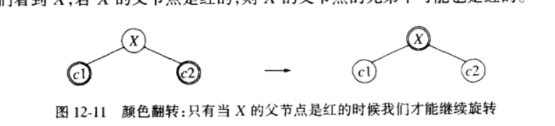

## 自顶向下伸展树
对于 **伸展树**：
- 当一项 X 作为一片树叶被 insert 时，称为 **展开（splay)** 的一系列树的选择使得 X 成为树的新的根
- 展开操作也在 find 期间，并且如果一项也没有找到，那么就要就访问路径上的最后的节点施行一次展开

### 伸展树的问题
展开操作的直接实现需要从根沿树往下的一次遍历，以及而后的从底向上的一次遍历，无论采用何种方式，均需大量的开销，而且两者都必须处理许多特殊的情况

为了解决操作复杂的问题，我们采用一种新的结构，自顶向下伸展树

### 自顶向下伸展树的实现
- 在访问的任一时刻，我们都有一个当前节点 X，它是其子树的根，在我们的图中它被表示成“中间”树
- 我们在开辟两个节点L、R，用 L 存放在树 T 中小于 X 的子树，用 R 存放节点大于 X 的子树
- 初始时 X 为 T 的根，而 L 和 R 是空树
- 依据情形对树进行分割：

1. 单旋转
- 如果旋转是一次单旋转，那么根在 Y 的树变成中间树的新根
- X 和子树 B 连接而成为 R 中最小项的左儿子；X 的左二子逻辑上成为 NULL，结果，X 成为 R 的新的最小项


2. 一字型
进行一次单旋转，然后将右子树 放到 R 上


3. 之字形
之字形我们可以简化，Z 不再是中间树的根，Y 取而代之


- 最后，我们要合并 L，R，X以形成一棵树


例子，如下图，我们要访问树中的 18


### 展开
```c++
Splay(ElementType item, Position x) {
  Position leftTreeMax, rightTreeMin

  headers.left = header.right = NullNode

  leftTreeMax = rightTreeMin = &header
  NullNode -> element = item

  while (item != x -> element) {
    if (item < x -> element) {
      if (item < x -> left -> element) {
        x = singleRotateWithLeft(x)
      }

      if (x -> left == NullNode) {
        break
      }

      rightTreeMin -> left = x
      rightTreeMin = x
      x = x -> left
    } else {
      if (item > x -> right -> element) {
        x = singleRotateWithRight(x)
      }

      if (x -> right == NullNode) {
        break
      }

      leftTreeMax -> right = x
      leftTreeMax = x
      x = x -> right
    }
  }

  leftTreeMax -> right = x -> left
  rightTreeMin -> left = x -> right

  x -> left = header.right
  x -> right = header.left

  return x
}
```

### 插入
```c++
insert(ElementType item, SplayTree t) {
  static Position newNode = null

  if (newNode == NULL) {
    newNode = malloc(sizeof(struct SplayNode))
    if (newNode == NULL) {
      FatalError('Out of space!!!')
    }
  }

  newNode -> element = item

  if (t == NullNode) {
    newNode -> left = newNode -> right = NullNode
    t = newNode
  } else {
    t = Splay(item, t)

    if (item < t -> element) {
      newNode -> left = t -> left
      newNode -> right =t
      t -> left = NullNode
      t = newNode
    } else if (item > t -> element) {
      newNode -> right = t -> right
      newNode -> left = t
      t -> right = NullNode
      t = newNode
    } else {
      return t
    }
  }

  newNode = NULL
  return t
}
```

### 删除
```c++
remove(ElementType item, SplayTree t) {
  Position newTree

  if (t != NullNode) {
    t = splay(item, t)

    if (item == t -> element) {
      if (t -> left == NullNode) {
        newTree = t -> right
      } else {
        newTree = t -> left
        newTree = splay(item, newTree)
        newTree -> right = t -> right
      }

      free(t)
      t = newTree
    }
  }

  return t
}
```

## 红黑树
红黑树是具有下列着色性质的二叉查找树：
1. 每一个节点或者着成红色，或者着成黑色
2. 根是黑色的
3. 如果一个节点是红色的，那么它的子节点必须是黑色的
4. 从一个节点到一个 NULL 指针的每一条路径必须包含相同数目的黑色节点

- 通过这些约束，对红黑树的操作在最坏情形下花费 O(log N) 时间，它的高度最多是 2log(N+1)
- 红黑树的优点是执行插入、删除所需要的开销相对较低，再有就是实践中发生的旋转相对较少
- 同样因为这些约束，红黑树的插入、删除都及其复杂

### 红黑树的初始化
我们用 NullNode 来指示一个 Null 指针
```c++
Position NullNode = NULL

initialize(void) {
  RedBlackTree t

  if (NullNode = NULL) {
    NullNode = malloc(sizeof(struct RedBlackNode))

    if (NullNode) {
      FatalError('Out of space!!')
    }

    NullNode -> left = NullNode -> right = NullNode
    NullNode -> color = black
  }

  t = malloc(sizeof(struct RedBlackNode))

  if (t == NULL) {
    FatalError('Out of space!!')
  }
  t -> element = NegInfinity
  t -> left = t -> right  = NullNode
  t -> color = black
  return t
}
```

### 红黑树的插入
- 新插入的节点必须涂成红色。如果它的父节点是黑的，我们插入完成
- 如果它的父节点是黑的，我们插入完成
- 如果它的父节点已经是红色的，那么我们得到连续红色节点，这就违反了条件3，在这种情况下，我们必须调整该树以确保条件3满足（且又不引起条件 4 被破坏）

#### 自底向上插入
如果父节点是红色的，且父节点的兄弟节点是黑色的，我们可以通过旋转来调整它们的位置


#### 自顶向下红黑树
我们可以从根节点向下遍历，在向下的过程中当我们看到一个节点 X 有两个红儿子的时候，我们让 X 成为红的而让它的两个儿子是黑



如上图，只有当 X 的父节点 P 也是红的时候这种翻转将破坏红黑树的法则，但是此时我们可以采用前面的旋转来调整它们的结构，另外，由于是从顶向下，所以 X 的父节点的兄弟节点不可能是红色

红黑树的类型声明和初始化：

```c++
typedef enum ColorType { Red, Black } ColorType

struct RedBlackNode {
  ElementType Element
  RedBlackTree Left
  RedBlackTree Right
  ColorType Color
}

Position NullNode = NULL

RedBlackNode
initialize(void) {
  RedBlackTree t

  if (NullNode == NUll) {
    NullNode = malloc(sizeof(struct RedBlackNode))
    if (NullNode == NULL) {
      FatalError('out of space!!!')
    }

    NullNode->left = NullNode->right = NullNode
    NullNode->color = black
    NullNode->element = Infinity
  }

  // 创建头结点
  t = malloc(sizeof(struct RedBlackNode))
  if (NullNode == NULL) {
    FatalError('out of space!!!')
  }

  t->element = NegInfinity
  t->left = t->right  = NullNode
  t->color = black

  return t
}
```


以下是旋转的编码，因为得到的树必须连接到父节点上，所以 rotate 把该父节点作为一个参数：
```c++
rotate(ElementType item, Position parent) {
  if (item < parent->element) {
    return parent->left = item < parent->left->element
      ? singleRotateWithLeft(parent->left)
      : singleRotateWithRight(parent->left)
  } else {
    return parent->right = item < parent->right->element
      ? singleRotateWithLeft(parent->right)
      : singleRotateWithRight(parent->right)
  }
}
```

最后是插入的过程，在从顶到下的过程中，我们把 item 作为参数传递，而不是跟踪旋转的类型

我们使用 HandleReorient 用来执行旋转的过程，在我们遇到带有两个红儿子的节点时被调用，在我们插入一片树叶时它也被调用


```c++
static Position x, p, gp, gpp

void handleReorient(ElemenetType item, RedBlackTree t) {
  x->color = red
  x->left->color = black
  x->right->color = black

  if (p->color == red) {
    if ((item < gp->element) != (item < p->element)) {
      p = rotate(item, gp)
    }
    x = rotate(item, ggp)
  }
  t->right->color = black
}
```

下面是插入的主程序：

```c++
insert(ElementType item, RedBlackTree t) {
  x = g = gp = t
  NullNode->element = item

  while (x->element != item) {
    ggp = gp
    gp = p
    p = x

    if (item < x->element) {
      x = x->left
    } else {
      x = x->right
    }

    // 如果两个子节点皆为红
    if (x->left -> color == red && x->right->color = red) {
      handleReorient(item, t)
    }
  }
 
  // 说明已在树内
  if (x != NullNode) {
    return NullNode
  }

  x = malloc(sizeof(struct RedBlackTree))

  if (x == NULL) {
    FatalError('Out of space!!!')
  }
  x->element = item
  x->left = x->right = NullNode

  if (item < p->element) {
    p->left = x
  } else {
    p->right = x
  }

  handleReorient(item, t)

  return t
}
```

### 红黑树的删除
红黑树的删除较为复杂，在这里分为两步
- 确定删除节点
- 执行删除操作

#### 确定删除节点
- 要删除的节点是树叶节点，直接删除即可
- 要删除的节点是非树叶节点，这里又分三种情况：

1. 带有两个儿子，我们使用右子树上的最小节点的值代替当前值，然后删除最小节点
2. 如果只有一个右儿子，也可以用使用 1 的方式删除
3. 如果只有一个左儿子，我们通过用其左子树上最大节点替换，然后删除最大节点

经过三步，我们确定了要删除的节点

#### 执行删除操作
由于要删除的节点是某个最大或者最小节点，所以该节点至多有一个儿子

- 如果该节点是红色的，可以直接删除，并把父节点与子节点连接起来
- 如果该节点是黑色的，那么可能违反条件4，造成黑色结点数量的左右不平衡，所以，我们需要分析删除一个黑色结点会遇到哪些情况并处理掉

针对删除黑色节点这种情况

我们令要删除的节点为 z，它的子节点为 x，用来取代 z，z 的父亲为 p，z 的兄弟节点为 w

##### 情况 1
x 的兄弟 w 是红色的，那么它们的父亲、w 的孩子都是黑色的

这种情况下只能做一种无损的操作，通过交换颜色再旋转，对树的性质不会产生影响，所以从根到 x 结点的路径上少的一个黑色结点也不会补上

交换p与w的颜色，再对p进行左旋操之后，x的新兄弟就为黑色，情况变成了2 3 4中的一种


##### 情况 2

x 的兄弟 w 是黑色，而且 w 的两个孩子都是黑色

此时可以细分为2种情况，但无论哪种情况，我们要进行的操作都是一样的，都是将w涂成红色，将 p 涂成黑色

如果是情况2.1(有可能由情况1发展过来的)，由于上述操作为 x 那边补上了一个黑色（从根到 x 在路径上多了一个黑色结点），此时红黑树性质5得到满足，程序结束

如果是情况2.2, 经过上述操作后，P的右子树也少了一个黑色结点，令 p 作为新的 x 继续循环


##### 情况 3

w 是黑色，w 在左孩子是红色，w 的右孩子是黑色

通过交换 l 与 w 的颜色，再对 w 进行右旋操作。这种操作也不会对红黑树性质产生影响，此时进入情况4，我们会看到通过情况4中的操作最终使红黑树性质得到满足，结束程序

图中最后边的 r 结点没有画出来，因为我们不关心它了


##### 情况 4

w 是黑色，w 的右孩子是红色

把 w 涂成 p 的颜色，把 p 涂成黑色，r 涂成黑色，左旋 p。此时从根到x在路径上多了一个黑色结点，程序结束


## 确定性跳跃表
**链接的**：如果至少存在一个指针从一个元素指向另一个元素，我们称两个元素是链接的

**间隙容量**：两个高度为 h 链接元素之间高度为 h - 1 的元素个数

在随机性跳跃表的基础上，为了保证只有常数个前向指针需要考查直到下降到更低的一层。为此，我们添加一个平衡条件

1-2-3确定性跳跃表 满足这样的性质：每一个间隙的容量为1，2，3，如下图就是一个 1-2-3确定性跳跃表

当我们沿任一层行进仅仅通过常数个指针然后就可下降到低一层。因此，在最坏的情形下查找的时间是 O(log N)


### 确定性跳跃表的实现
在我们的实现中，每一个节点都留有使我们下降一层的指针，指向同层上的下一个节点的指针以及逻辑上存储在下一项中的项，如果一个节点在抽象表示中的高度为 h，那么它的项在实际实现中就会出现在 h 个地方

- 每个基本节点由一个关键字和两个指针组成
- 对头节点和底层节点都有一个标记以代替 NULL 指针，非常巧妙

以下是示意图：


以下是初始化代码：

```c++
struct SkipNode {
  ElementType element
  SkipList right
  SkipList down
}

static Position bottom = NULL
static Position tail = NULL

SkipList
initialize(void) {
  SkipList L

  if (bottom == NULL) {
    bottom = malloc(sizeof(struct SkipNode))
    if (bottom == NULL) {
      FatalError('Out of space!!!')
    }

    tail = malloc(sizeof(struct SkipNode))
    if (tail == NULL) {
      FatalError('Out of space!!!')
    }

    tail->element = Infinity
    tail->right  = tail
  }

  // 创建 header
  l = malloc(sizeof(struct SkipNode))
  if (l == NULL) {
    FatalError('Out of space!!!')
  }

  l->element = Infinity
  l->right = tail
  t->down = bottom

  return l
}
```

### 确定性跳跃表的查找
查找很简单

```c++
Position
find(ElementType item, SkipList l) {
  Position current = l
  
  bottom->element = item
  while(item != current->element) {
    if(item < current->element) {
      current = current->down
    } else {
      current = current->right
    }
    return current
  }
}
```

### 确定性跳跃表的插入
为了执行插入，我们必须保证当一个高度为 h 的新节点加入进来时不会产生具有4个高度为 h 的节点间隙

- 设我们在第 L 层上，并正要下降到下一层去
- 如果我们要降到的间隙容量是3，那么我们提高该间隙的中间项使其高度为 L，从而形成两个容量为 1 的间隙

如下图插入27的例子


<br/>


下面是插入的代码

```c++
SkipList
insert(ElementType item, SkipList l) {
  Position current = l
  Position newNode

  while (current != bottom) {
    while (item > current->element) {
      current = current->right
    }

    if (current->element > current->down->right->right->element) {
      newNode = malloc(sizeof(struct SkipNode))
      if (newNode == NULL) {
        FatalError('Out of space!!!')
      }

      newNode->right = current->right
      newNode->down = current->down->right->right
      current->right = newNode
      newNode->element = current->element
      current->element - current->down -> right->element
    } else {
      current = current->down
    }
  }

  if (l->right != tail) {
    newNode = malloc(sizeof(struct SkipNode))
    if (newNode == NULL) {
      FatalError('Out of space!!!')
    }

    newNode->down = l
    newNode->right = tail
    newNode->element = Infinity
    l = newNode
  }

  return l 
}
```

#### 另一种实现方式
如果我们把一些项存储在三个元素的一个数组中，那么对于第三项的访问可以直接进行，而不用再通过两个 right 指针,如下图：


