## 排序

这里我们讨论的排序都是 **基于比较的排序**，除赋值运算外，"<"，">"是仅有的允许对输入数据进行的操作

### 定理

1. 通过交互相邻元素进行排序的任何算法平均需要 O(N2) 时间

### 插入排序 时间复杂度为 O(N2)

**插入排序** 由 N-1 趟排序组成。对于 P = 1 趟到 P = N-1 趟，**插入排序** 保证从位置 0 到位置 P 上的元素为已排序状态
 
- 将数组分为两个部分，数组的第一个元素为一个部分，剩下的元素为一部分
- 从数组的第二个元素开始，和该元素以前的所有元素比较，如果之前的元素没有比该元素大的，那么该元素的位置不变
- 如果有元素的值比该元素大，例如I，该元素的位置为k，则将从i到k位置上的所有元素往后移动一位，然后将k位置上的值移动到i位置上。这样就找到了K所在的位置
- 每一个元素都这样进行，最终就会得到排好顺序的数组

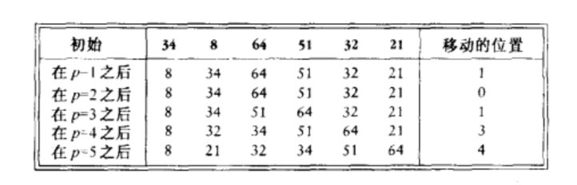

```C++
InsertionSort(ElementType a[], int n) {
  int j, p

  ElmentType tmp
  for (p = 1; p < N; p++) {
    tmp = a[p]
    for (j = p; j > 0 && a[j - 1] > tmp; j--) {
      a[j] = a[j - 1];
    }
    a[j] = tmp
  }
}
```

### 冒泡排序
冒泡排序每趟排序让相邻元素两两比较选出一个最大（小）的值放到待排序的序列最后位置

```c++
void bubbleSort(int a[], int length) {
  for(int i = 0; i < length; i++) {
      for(int j = 0; j < length - i - 1; j++) {
        if(a[j] > a[j+1]) {
        int temp = a[j];

        a[j] = a[j + 1];
        a[j + 1] = temp;      
      }
    }
  }
}
```

排序过程如下所示：
|初始状态|a[0]|a[1]|a[2]|a[3]|a[4]|a[5]|
|------|----|----|----|----|----|----|
|初始值|5|2|3|6|1|4|
|第一趟排序过程||||||
||５|２|３|６|１|4|
||２|５|３|６|１|4|
||２|３|５|６|１|４|
||２|３|５|６|１|４|
||２|３|５|１|６|４|
||2|3|5|1|4|6|
|第二趟|2|3|1|4|5|6|
|第三趟|2|1|3|4|5|6| 
|第四趟|1|2|3|4|5|6|
|第五趟|1|2|3|4|5|6|
|第六趟|1|2|3|4|5|6|

### 选择排序
选择排序每趟排序在待排序序列里选择一个最小的拿出来放到已排序序列的后面

```c++
void selectionSort(int a[],int length) {
  //第i趟 a[i]后所有数跟a[i]比较  
  for(int i = 0; i < length; i++) {  
    //找到a[i]~a[length-1]中最小的数与a[i]交换     
    for(int j = i + 1; j < length; j++) {
      if(a[i] > a[j]) {
      int temp = a[j];
      a[j] = a[i];
      a[i] = temp;
      }
    }
  }
}
```

|初始状态|a[0]|a[1]|a[2]|a[3]|a[4]|a[5]|
|------|----|----|----|----|----|----|
|初始值|5|2|3|6|1|4|
|第一趟排序过程||||||
||5|2|3|6|1|4|
||2|5|3|6|1|4|
||2|3|5|6|1|4|
||1|5|3|6|2|4|
||2|3|5|1|6|4|
||1|5|3|6|2|4|
|第二趟|1|2|5|6|3|4|
|第三趟|1|2|3|6|5|4| 
|第四趟|1|2|3|4|6|5|
|第五趟|1|2|3|4|5|6|
|第六趟|1|2|3|4|5|6|


### 希尔排序（缩小增量排序）

- **希尔排序** 使用一个序列 h1,h2,h3,h4,ht,叫做**增量序列**
- 在使用增量 hk 的一趟排序之后（所有相隔 hk 的元素都被排序），对于每一个 i 我们有 A[i] <= A[i + hk]，此时称文件是 **hk-排序**的
- 一趟 hk-排序 的作用就是对 hk 个独立的子数组执行一次插入排序

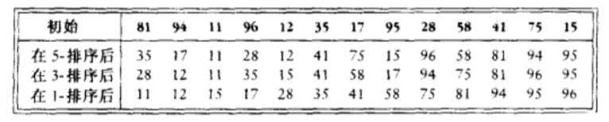

```C++
  shellSort(ElementType A[], int N) {
    int i, j, Increment;
    ElementType Tmp;

    for (Increment = N / 2; Increment > 0; Increment /= 2) {
      for (i = Increment; i < N; i++) {
        Tmp = A[i]

        for (j = i; j >= Increment; i -= Increment) {
          if(Tmp < A[j - Increment]) {
            A[j] = A[j - Increment]
          } else {
            break
          }
        }

        A[j] = Tmp
      }
    }    
  }
```

**希尔排序** 的运行时间依赖于增量序列的选择，最坏情况下的运行时间为 O(N2)
采用 *Hibbard* 增量的最坏情形下运行时间为 O(N 3/2)
采用 *Sedgewick* 增量的最坏运行时间为 O(N 4/3)，平均运行时间为O(N 7/6)

**希尔排序** 的简单特点使得它成为对适度地大量的输入数据经常选用的算法

### 堆排序

- 建立 N 个元素的 **二叉堆**
- 执行 N 次 DeleteMin，按照顺序，最小的元素先离开堆
- 通过将这些元素记录到第二个数组然后再将数组拷贝回来，我们得到 N 个元素的排序
- 由于每个 DeleteMin 花费时间 O(log N)，因此总的执行时间为 O(N log N)

该算法最大的问题是它使用了一个附加的数组，因此，存储需求增加一倍

#### 第二种解法

- 在每次 DeleteMin 之后，堆缩小了1，因此，位于堆中最后的元素可以用来存放刚刚删去的元素
- 使用这种策略，在最后一次 DeleteMin 后，该数组将以递减的顺序包含这些元素，也就完成了排序

```c++
  leftChild(i) {
    return 2 * i + 1
  }

  percDown(ElementType A[], int i, int N) {
    int Child
    ElementType Tmp

    for (Tmp = A[i]; leftChild(i) < N; i = Child) {
      Child = leftChild(i)
      if(Child != N - 1 && A[Child + 1] > A[Child]) {
        Child++
      }

      if(Tmp < a[Child]) {
        A[i] = A[Child]
      } else {
        break
      }
    }

    A[i] = Tmp
  }

  heapSort(ElementType A[], int N) {
    int i

    for(i = N / 2; i >= 0; i--) {
      percDown(A, i, N)
    }

    for(i = N - 1; i > 0; i--) {
      Swap(&A[0], &A[i])
      percDown(A, 0, i)
    }
  }
```

### 归并排序

**归并排序** 以 O(N log N) **最坏情形运行时间** 运行，所使用的比较次数几乎是最优的

**归并排序** 的基本操作是合并两个已排序的表，因为这两个表是已经排序的，所以若将输出放到第三个表中时，则该算法可以通过对输入数据一趟排序来完成

具体步骤如下：
- 取两个输入数组 A 和 B，一个输出数组 C，以及三个计数器 Aptr，Bptr，Cptr，它们初始置于对应数组的开始端
- A[Aptr] 和 B[Bptr] 中的叫较小者被拷贝到 C 中的下一个位置，相关的计数器向前推进一步
- 当两个输入表中有一个用完的时候，则将另一个表中剩余部分拷贝到C中

通过递归地将前半部分数据和后半部分数据各自归并排序，得到排序后的两部分数据，然后再将两部分合并到一起，直到完成整个数组

**分治策略**：将问题分为一些小的问题然后递归求解，而治的阶段则将分的阶段解得的各个答案修补到一起

归并排序的实现见下图，整个 merge 是非常巧妙的，它只利用了个临时数组就完成了两个数组的合并，如果每次 merge 都创建一个零时数组，那么对内存的利用都是致命的

```c++
mSort(ElementType a[], ElementType tmpArray[], int left, int right) {
  int center

  if(left < right) {
    center = (left + right) / 2
    mSort(a, tmpArray, left, center)
    mSort(a, tmpArray, center + 1, right)
    merge(a, tmpArray, left, center + 1, right)
  }
}

merge(ElementType a[], ElementType tmpArray[], int lPos, int rPos, int rightEnd) {
  int i, leftEnd, numElements, tmpPos;

  leftEnd = rPos - 1
  tmpPos = lPos
  numElements = rightEnd - lPos + 1

  while(lPos <= leftEnd && rirht <= RightEnd) {
    if(a[lPos] <= a[rPos]) {
      tmpArray[tmpPos++] = a[lPos++]
    } else {
      tmpArray[tmpPos++] = a[rPos++]
    }
  }

  while(lPos <= leftEnd) {
    tmpArray[tmpPos++] = a[lPos++]
  } 

  while(rPos <= rightEnd) {
    tmpArray[tmpPos++] = a[rPos++]
  }

  for(i =0; i < numElements; i++, rightEnd--) {
    a[RightEnd] = tmpArray[rightEnd]
  }
}

mergeSort(ElementType a[], int n) {
  ElementType tmpArray
  tmpArray = malloc( n * sizeof(ElementType))

  if(tmpArray !== NULL) {
    mSort(A, tmpArray, 0, n - 1)
    free(tmpArray)
  }
}
```

虽然 **归并排序的运行时间**是O(N log N)，但是它很难用于主存排序，主要问题在于合并两个排序的表需要线性附加内存，在整个算法中还要花费将数据拷贝到临时数组再拷贝回来这样一些附加的工作，其结果严重放慢了排序的速度

### 快速排序

**快速排序**是在实践中最快的已知排序算法，基于它非常精炼和高度优化的内部循环，它的平均运行时间是 O(N log N)，最坏情形的性能为 O(log N2)
它分为以下4步，

1. 如果S中元素个数是 0 或 1，则返回
2. 取 S 中任一元素 v，称之为 **枢纽元**
3. 将 S - |v| 分成两个不想交的集合： S1 = { x ¢ S - |v|| x <= v } 和 S1 = { x ¢ S - |v|| x >= v }
4. 返回 `guickSort( S1) 后`，继而 `quickSort(S2)`

可见，**枢纽元** 的选择直接影响了 **快速排序** 的性能，直观来看，我们希望 **枢纽元**是正好中间的元素，这样 S1 中占一半的元素，S2 中占一半的元素
当在适当的位置分割两个数组，会使该算法非常的高效

#### 选取枢纽元

**一种错误的方法**：选取第一个元素作为枢纽元或选取前两个互异的关键字中的较大者作为枢纽元，如果数组是排过序的，则排序时间是二次的
**一种安全的作法**：随机选取枢纽元
**三数中值分割法**：使用左端、右端和中心位置上的三个元素的中值作为枢纽元

#### 分割策略
- 选出 *枢纽元*，将枢纽元与最后的元素交换使得枢纽元离开要被分割的数据段，i 从第一个元素开始而 j 从倒数第二个元素开始
- 当 i 在 j 的左边时，我们将 i 右移，移过那些大于枢纽元的元素
- 当 i 和 j 停止时，i 指向一个大元素而 j 指向一个元素。如果 i 在 j 的左边，那么将这两个元素互换，其效果是把一个大元素移向右边而把一个小元素移向左边
- 分割的最后一步是将枢纽元与 i 所指向的元素交换

此时，在位置 P < i 的每一个元素都是小元素，在位置 P > i 上的元素必然都是大元素

考虑到相同元素，我们也让 i，j 移动，尽管会在相等的元素间进行很多次无意义的交换，但是这会建立两个均衡的子数组

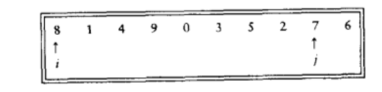
</br>
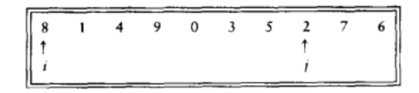
</br>
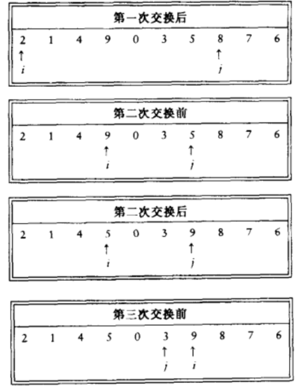
</br>
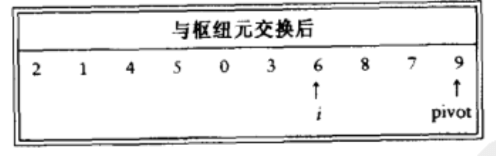

#### 小数组
由于快速排序一般都是递归实现，所以我们要处理小数组的情况。一般情况下，对于小的数组不递归地使用快速排序，而是诸如插入排序这样的对小数组有效的排序算法，一种好的截止范围是 N = 10

#### 实现

```c++
quickSort(ElementType a[], int n) {
  qSort(a, 0, n - 1)
}

median3(ElementType a[], int left, int right) {
  int center = (left + right) / 2

  if(a[left] > a[center]) {
    swap(&a[left], &a[center])
  }

  if(a[left] > a[right]) {
    swap(&a[left], &a[right])
  }

  if(a[center] > a[right]) {
    swap(&a[center], &a[right])
  }

  swap(&a[center], &a[right - 1])
  return a[right - 1]
}

qSort(ElementType a[], int left, int right) {
  int i, j
  ElementType pivot

  if(left + cutoff <= right) {
    pivot = median3(a, left, right)
    i = left
    j = right - 1

    for(;;) {
      while(a[++i] < pivot) {}
      while(a[--j]>pivot) {}
      if(i < j) {
        swap(&a[i], &a[j])
      } else {
        break
      }
    }

    swap(&a[i], &a[right - 1])
    qSort(a, left, i - 1)
    qSort(a, i + 1, right)
  } else {
    // 插入排序
    insertionSort(a + left, right - left + 1)
  }
}
```

#### 快速选择
**快速选择** 的思路类似于 **快速排序**，用来寻找 集合S 中第 k 个最小的元素，它的思路是

1. 如果 |S| = 1，那么 k = 1，并将 S 中的元素作为答案返回。如果使用小数组的截止方法且 |S| <= Cutoff，则将 S 排序并返回第 k 个最小元
2. 选取一个枢纽元 v ¢ S
3. 将集合 S - |v| 分割成 S1 和 S2
4. 如果 k <= |S1|，返回 quickSelect(S1, k)。如果 k = 1 + |S1|，那么返回枢纽元，否则，返回 quickSelect(S2, k - |S1| - 1)

由于只做了一层递归，所以这个算法的平均时间复杂度是 O(N)

```c++
qSelect(ElementType a[], int k, int left, int right) {
  int i, j
  ElementType pivot

  if (left + cutoff <= right) {
    pivot = median3(a, left, right)

    for (; ;) {
      while (a[++i] < pivot) { }
      while (a[--j] > pivot) { }
      if (i < j) {
        swap(&a[i], &a[j])
      } else {
        break
      }

      swap(&a[i], &[right - 1])

      if(k <= i) {
        qSelect(a, k, left, i - 1)
      } else if(k > j + 1) {
        qSelect(a, k, j + 1, right)
      }
    }
  } else {
    insertionSort(a + left, right - left + 1)
  }
}
```

### 排序的一般下界
在平均情况下，只用到比较的任意排序算法都需要进行 O(N log N) 次比较

图是 a,b,c 三个元素大小的决策树

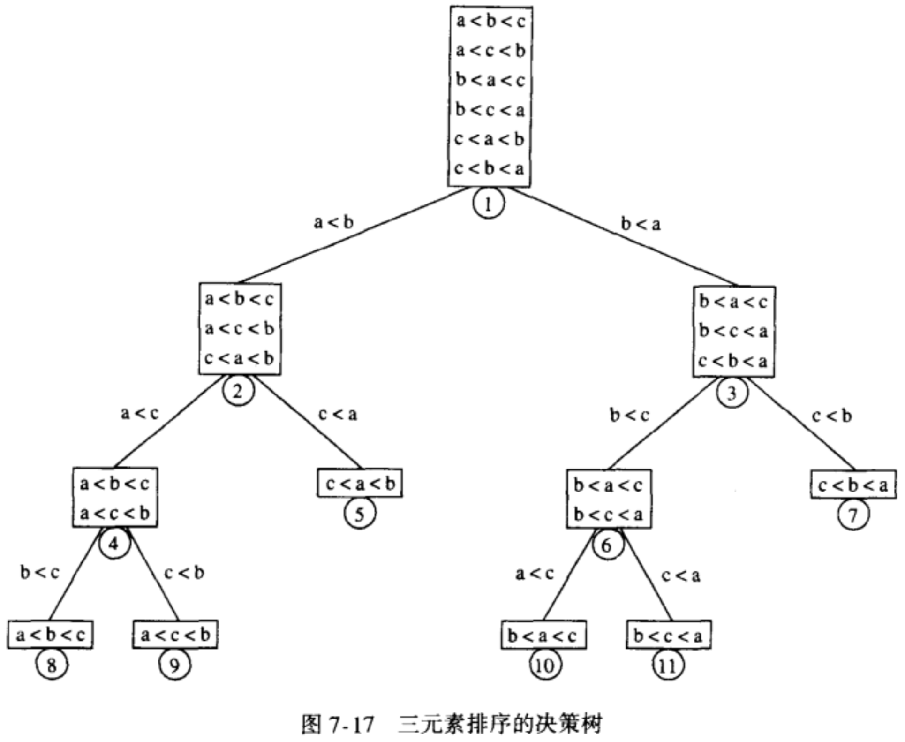

由排序算法所使用的比较次数等于最深树叶的深度

**推导**

令 T 是深度为 d 的二叉树，则 T 最多有 2^d 个树叶

- => 具有 L 片树叶的二叉树的深度至少是 [log L]
- => 只使用元素间比较的任何排序算法在最坏情况下至少需要 [log (N!)] 次比较
- => 只使用元素间比较的任何排序算法需要进行 O(N log N) 次比较

### 桶式排序
该算法时间复杂度为 O(N)

- 输入数据 A1,A2,...,An 必须只由小于M的正整数组成
- 使用一个大小为 M 称为 Count 的数组，它被初始化为 0，于是，Count 有 M 个单元，这些桶初始化为空
- 当读 Ai时，Count[Ai] 增1，在所有的输入数据读入后
- 扫描数组 Count，打印出排序后的表

桶式排序给了我们一个思路：如果存在额外的可用信息，我们应该有望找到更为有效的算法，否则这额外的信息就被浪费了

### 外部排序
前面所有的算法都需要将输入数据装入内存，然而很多应用它们的输入数据量太大装不进内存，读入数据花费的时间可能远大于排序的时间，所以我们需要采用另外一种适用于外部的排序，考虑读取数据的消耗，这种排序必须满足读取的顺序性

所以，我们采用另外一种排序
- 基本的外部排序算法使用归并排序中的 Merge 
- 设我们有 4 盘磁带，Ta1,Ta2,Tb1,Tb2，分别是 两盘 a 为输入磁带和两盘输出磁带
- 从输入磁带一次读入 M 个记录，在内部将这些记录排序，并将这些排过序的记录交替地写到 b 磁带上，形成一个顺串
- 做完这些后，我们倒回所有磁带，将每个磁带的第一个顺串取出并将两者合并，把结果写到 Ta1 上，该结果是一个二倍长的顺串
- 继续这个过程，交替使用 Ta1 和 Ta2，直到 Tb1 或 Tb2 为空
- 重复相同的步骤，直到得到总长为 N 的一个顺串

该算法总共需要 [log(N / M)] 趟工作，外加一趟构造初始的顺串

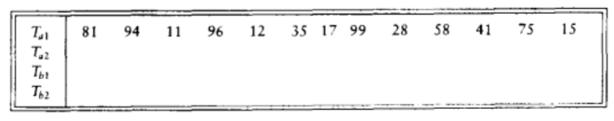
<br/>
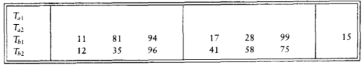
<br/>
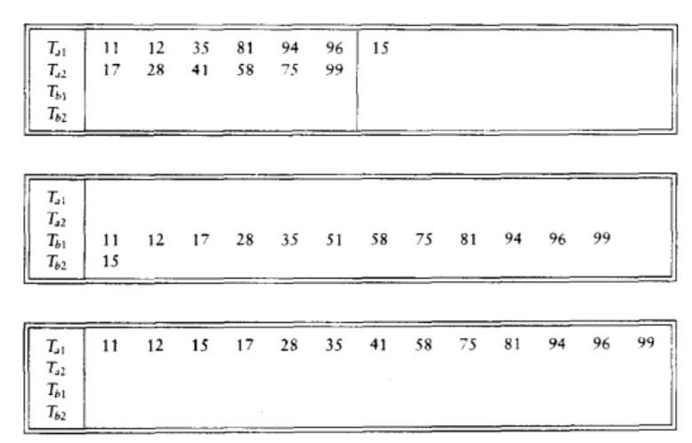
<br/>

#### 多路合并

如果我们有额外的磁带，那么我们可以减少将输入数据排序所需要的趟数，通过将基本的（2-路）合并扩充为 k-路合并
当有 K 盘输入磁带，发现 K 个元素中最小的元素的过程稍微有些复杂，我们可以通过使用优先队列找出这些元素中的最小元，为了得到下一个写到磁盘上的元素，我们进行一次 DeleteMin 操作，将相应的磁带向前推进

#### 多相合并
k-路合并需要使用 2k 盘磁带，我们可用复用磁带，只使用 k + 1 盘磁带就完成排序的工作

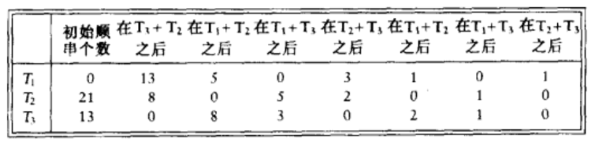

#### 替换选择
在顺串的构造上，最简的方法是：
- 读入尽可能多的记录并将它们排序，再把结果写到某个磁带上

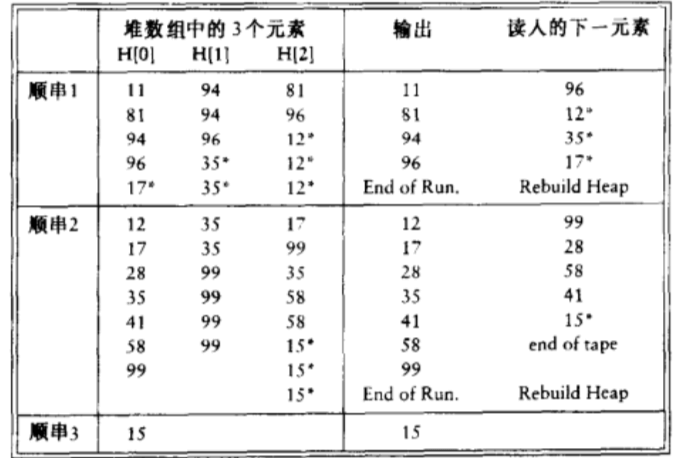

还有一种做法：
- 直到实现只要第一个记录被写到输出磁带上，它所使用额内存就可以被另外的记录使用
- 如果输入磁带上的下一个记录比我们刚刚输出的记录大，那么它就可以被放入这个顺串中

这种产生顺串的算法称为**替换选择**，通过该算法产生的顺串数较小，合并的趟数也会减少，从而减少运行时间

- 开始， M 个记录被读入内存并被放到一个优先队列中
- 我们执行一次 DeleteMin，把最小的记录写到输出磁带上，再从输入磁带读入下一个记录
- 如果它比刚刚写出的记录大，那么我们可以把它加到优先队列中，否则，不能把它放入当前的顺串
- 由于优先队列少一个元素，因此，我们可以把这个新元素存入优先队列的死区
- 我们继续这样的步骤直到优先队列的大小为零，此时该顺串构建完成
- 我们使用死区中的所有元素通过建立一个新的优先队列开始构建一个新的顺串

