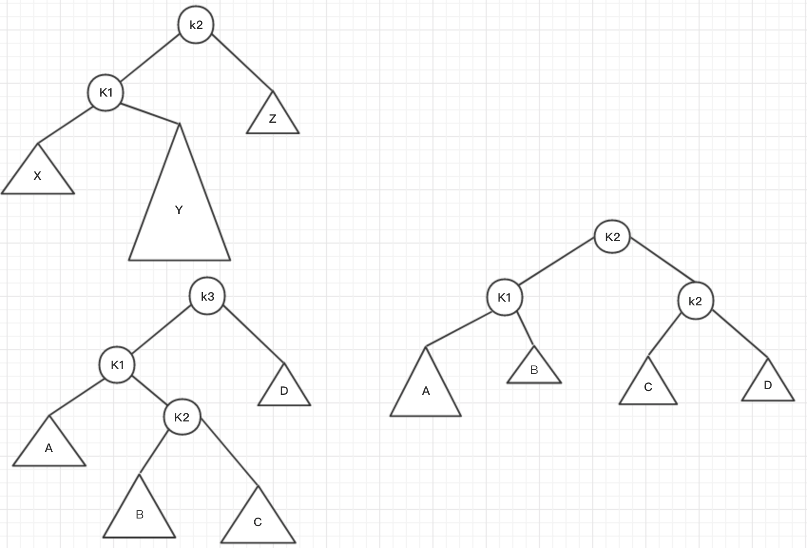
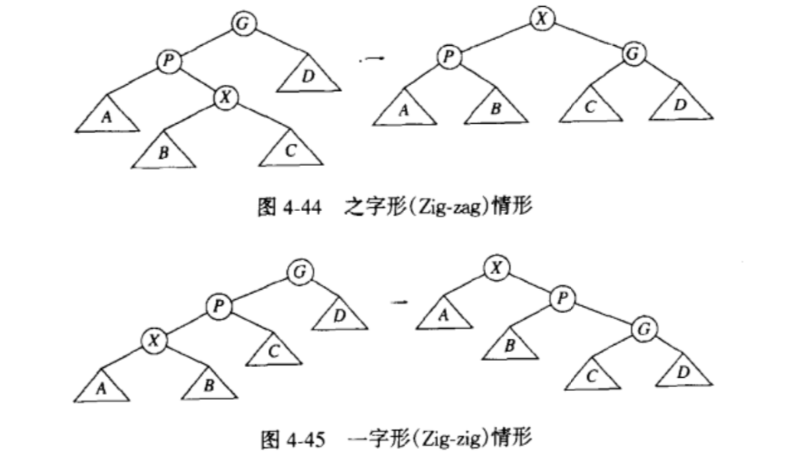

对于大量的输入数据，链表的线性访问时间太慢，此时，可以使用树的数据结构

### 树（tree）
#### 定义
- 树（tree）：一些节点的集合
- 根（root）
- 子树：一棵完整的但不包含根节点的树
- 边（edge）：节点相互连接的单位
- 子节点（child）：
- 父节点（parent）：
- 树叶（leaf）：没有子节点的节点
- 兄弟节点（sibling）：具有相同父节点的节点
- 路径（path）：从 n1 到 nk 的路径为 n1，n2,...,nk(结束节点)的一个序列，并且上一个节点是下一个节点的父节点
- 路径的长（length）：该路径上的边的条数，每个节点到自身的长度为0，在一棵树中从根节点到每个节点恰好存在一条路径
- 深度（depth）：对任意节点 ni，从根节点到 ni 的唯一路径的长。因此，根节点的深度为0
- 高（height）：对任意节点 ni，从 ni 到一片子树叶最长路径的长 。因此，所有子树叶的高都是0，一棵树的高等于它的根的高
- 祖先（ancestor）和后裔（descendant）：如果存在从 n1 到 n2 的一条路径，那么 n1 是 n2 的一位祖先，而 n2 是 n1 的一个后裔
- 真祖先（proper ancestor）和真后裔（proper descendant）：满足上条且 n1 != n2

#### 树的实现

1. 每一个节点除了数据外还要有一些指针，使得该节点的每一个子节点都有一个指针指向它
2. 将每个节点记录在链表中，父节点记录链表头，即第一个子节点
3. 每个节点都有指针指向兄弟节点（sibling）

#### 树的应用
- 操作系统中的文件系统
- react 中的 fiber 结构

#### 树的遍历
- 先序遍历：对节点的处理工作是在它的诸儿子节点被处理之前进行的
- 后序遍历：在一个节点处的工作是在它的诸儿子节点被处理后进行的
- 中序遍历：先处理左子树，在处理中节点，最后处理右子树
- 层序遍历：所有深度为 D 的节点要在深度 D+1 的节点之前进行处理

### 二叉树（binary tree）
- 一棵树，且每个节点都不能有多余两个子节点
- 二叉树的一个性质是平均二叉树的深度要比 N 小得多，**查找二叉树**深度的平均值是 O(log N)

#### 二叉树的实现
1. 因为一棵二叉树最多有两个子节点，所以我们可以用指针直接指向它们
2. 一个节点包含内容信息和左右子树的指针

#### 二叉树的应用
- 编译器的设计，如表达式树
  1. 表达式树的树叶是**操作数**，比如常量和变量
  2. 其他的节点为**操作符**
  3. 通过不同的遍历方式，我们可以运行表达式

### 二叉查找树
- 在二叉树的基础上，保证对于树中的每个节点 X，它的左子树中所有关键字值小于 X 的关键字值，而它的右子树中所有关键字值大于X的关键字值
- 该树所有的元素都可以用某种统一的方式排序
- 由于树的递归定义，大多数二叉查找树采用递归实现，因为二叉查找树的平均深度是 0(log N)，一般不必担心栈空间被用尽

### 二叉查找树的操作
- Find
  1. 在树 T 中查找具有关键字 X 的节点的指针，先判断 T 是否为 null
  2. 不为 null 的话就判断 x 与 当前 T 的关键字的关系，递归调用树 T 的左子树或者右子树直到找到节点为止

- FindMin：从根节点一直向左，终止点就是最小的元素
- FindMax：从根节点一直向右，终止点是最大的元素
- Insert：为了将 X 插入到树 T 中，可以像用 Find 那样沿着树查找，如果找到 X，则什么也不用做。否则，将 X 插入到遍历的路径上的最后一个点上，重复元的插入可以通过在节点记录中保留一个附加域以指示发生的频率来处理
- Delete：
  1. 如果节点是一片树叶，那么它可以直接被立即删除。如果节点有一个子节点，则该节点可以在其父节点调整指针绕过该节点后被删除
  2. 若删除的节点具有两个子节点，用其右子树的最小的数据代替该节点的数据并递归地删除那个节点，因为右子树中最小的节点不可能有左边的子节点。但是它的效率不高，因为一次删除要遍历两次
  3. 如果删除的次数不多，可以使用**懒惰删除**，当一个元素要被删除时，它仍留在树中，而是只做了个被删除的记号。这种做法特别是在有重复关键字时很流行，因为此时记录出现频率数的域可以减1

所有操作的时间复杂度都为O(d)，d与树的深度有关，而二叉树平均深度为O(log N)

由于二叉查找树的时间复杂度与深度强关联，在连续插入时，很可能会加大树的深度，导致花费很多的运算时间。为了优化这种情况，会在二叉查找树中添加一个平衡条件：**任何节点的深度均不得过深**

### AVL(平衡二叉树)
每个节点的左子树和右子树的高度最多差1的二叉查找树，在这种前提下，所有的树操作都可以以 O(log N) 执行
为了保证 ASL 的特性，每次插入后需要通过简单的修正，这种修正我们称为**旋转**

### AVL 的单旋转和双旋转
在插入之后，只有那些从插入点到根节点的路径上的节点的平衡可能被改变，因为只有这些节点的子树可能发生变化，我们找到第一个破坏了 AVL 条件的节点

加入这个需要重新平衡平衡的节点为 a，由于任意节点最多有两个子节点，因此高度不平衡时，a 点的两棵子树的高度差 2，这种不平衡可能出现在以下四种情况

1. 对 a 的左子节点的左子树进行一次插入
2. 对 a 的左子节点的右子树进行一次插入
3. 对 a 的右子节点的左子树进行一次插入
4. 对 a 的右子节点的右子树进行一次插入

我们把1，4情况称为“外边”，该情况通过对树的一次**单旋转**完成调整
3，4称为“内部”的情况，需要通过**双旋转**完成调整

#### 单旋转
如图，节点 K2 已经不满足 AVL 的特性，并且满足情形1，4，为使树恢复平衡，我们把 X 上移一层，并把 Z 下移一层。使 K1 成为根，在原树中 K2 > K1，于是在新树中 K2 变成了 K1 的右子节点，X 和 Z 仍然是 K1 的左子节点和 K2 的右子节点，子树 Y 包含原树中介于 K1 和 K2 之间的那些节点，可以将它放在新树中 K2 的左子节点是的位置上，这样对所有顺序的要求都得到满足


以下是执行单旋转的例程
```c++
static Position
singleRotateWithLeft(Position k2) {
  Position k1

  k1 = k2->left
  k2->left = k1->right
  k1->right = k2

  k2->height = max(height(k2->left), height(k2->right)) + 1
  k1->height = max(height(k1->left), k2->height) + 1

  return k1
}
```

#### 双旋转
如图，节点 K2 是不满足 AVL 的节点，切满足情形2，3，这时采用的是双旋转，将 K2 用作新的根，这迫使 K1 是 K2 的左儿子节点，K3是它的右子节点，在将 K2 的两棵子树移到相应的节点，从而完全确定了这四棵树的最终位置，这样对所有顺序的要求都得到满足



以下是双旋转的例程：

```c++
static Position
doubleRotateWithLeft(Position k3) {
  k3->left = singleRotateWithRight(k3->left)

  return singleRotateWithLeft(k3)
}
```

### 伸展树
- 当一个节点被访问后，它就要经过一系列 AVL树 的旋转被放到根上
- 如果一个节点很深，那么在其路径上就存在许多的节点也相对较深，通过重新构造可以使对所有这些节点的进一步访问所花费的时间更少
- 因此，如果节点过深，要求每次重新构造都应具有起到平衡这棵树（到某种程度）的作用

#### 展开
展开的思路类似于前面介绍的旋转的想法。
- 令 X 是在访问路径上的一个（非根）节点，我们将在这个节点上实施旋转操作。如果 X 的父节点是树根，那么我们只要旋转 X 和树根。这就是沿着访问路径上的最后的旋转
- 否则，X 就有父亲（P）和祖父（G），存在两种情况以及对称的情形要考虑
  1. 第一种情况是之字形，需要执行一次像 AVL 那样的双旋转
  2. 否则，出现另一种一字形，只需要执行单旋转



### B-树
阶为 M 的 B-树是一棵具有下列结构特征的树：
- 树的根或者是一片树叶，或者其儿子数在 2 和 M 之间
- 除根外，所有非树叶节点的儿子数在 [M/2] 和 M 之间
- 所有的树叶都在相同的深度上

对于一般的 M 阶 B 树，当插入一个关键字时，唯一的困难发生在接收该关键字的节点已经具有 M 个关键字的时候。这个关键字使得该节点具有 M+1 个关键字，我们可以把它分裂成两个节点，它们分别具有 [(M+1)/2] 和 [(M+1)/2] 个关键字。由于这使得父节点多出一个儿子，因此我们必须检查这个节点是否可被父节点接受，如果父节点已经具有 M 个儿子，那么这个父节点就要被分裂成两个节点。我们重复这个过程直到找到一个父节点具有少于 M 个儿子。如果我们分裂根节点，那么我们就要创建一个新的根，这个根有两个儿子

注意：从运行时间考虑，M的最好选择是 M = 3 或 M = 4，当 M 再增大时插入和删除的时间就会增加

下图是一个 3 阶 b-树 的例子


#### 应用
B-树实际用于数据库系统，在那里树被存储在物理的磁盘而不是主存中。一般说来，对磁盘的访问要比任何的主存操作慢几个数量级。如果使用 M 阶 B-树，那么磁盘访问次数是 O(log MN)，虽然每次磁盘访问花费 O(log M) 来确定分支的方向，但是执行该操作的时间一般要比读存储器的区块所花费的时间少得多


