### 异步I/O

#### 为什么要异步I/O
   - 用户体验：I/O是昂贵的，分布式I/O是更昂贵的
   - 资源分配：I/O的调用不再阻塞后续运算，将原有等待I/O完成的这段时间分配给其余需要的业务区执行

#### 阻塞I/O与非阻塞I/O
操作系统对计算机进行了抽象，将所有输入输出设备抽象为文件。内核在进行文件I/O操作时，通过文件描述符进行管理，而文件描述符类似于应用程序与系统内核之间的凭证。应用程序如果需要进行I/O调用，需要先打开文件描述符，然后再根据文件描述符去实现文件的数据读写。阻塞I/O完成整个获取数据的过程，非阻塞I/O不带数据直接返回，要获取数据，还需要通过文件描述符再次获取

- 阻塞I/O：调用之后一定要等到系统内核层面完成所有操作后，调用才结束
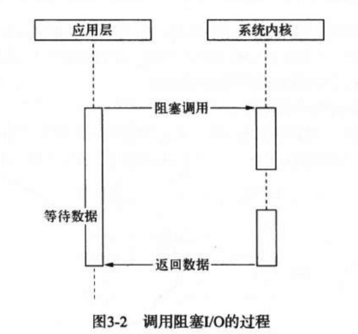
- 非阻塞I/O：调用之后立即返回状态，待获取完整的数据后，再继续
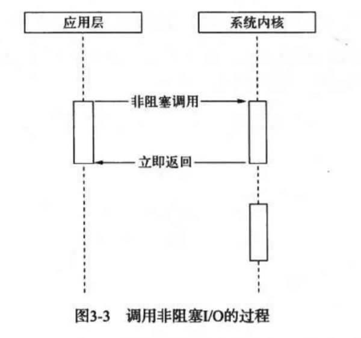

#### 轮询的类型
非阻塞I/O为了获取完整的数据，应用程序需要重复调用I/O操作来确认是否完成。这种重复调用判断操作是否完成的技术叫做轮询，现存的轮询技术有以下：

- read：通过重复调用来检查I/O的状态来完成完整数据的读取。在得到最终数据前，CPU一直耗用在等待上
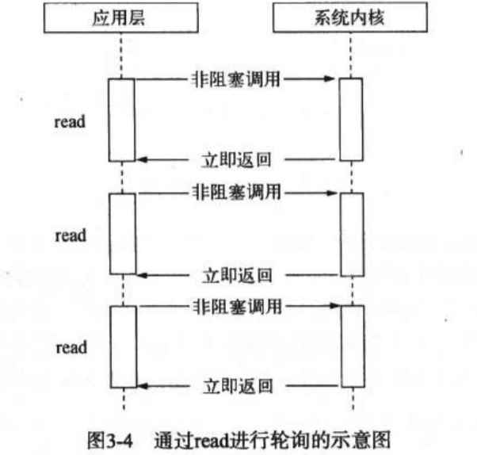
- select：read改进版，通过对文件描述符上的事件状态来进行判断，采用一个1024长度的数组来存储状态，所以它最多可以同时检查1024个文件描述符
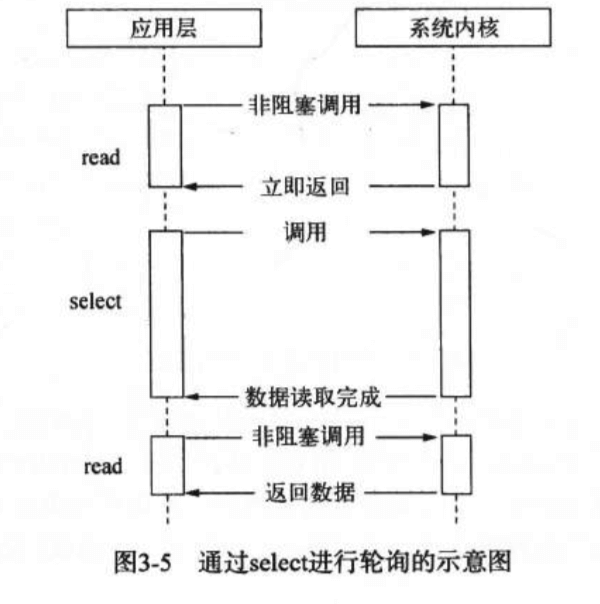
- poll：select的改进，采用链表的方式避免数组长度的限制，其次它能避免不需要的检查。但是当文件描述符较多的时候，性能还是十分低下的
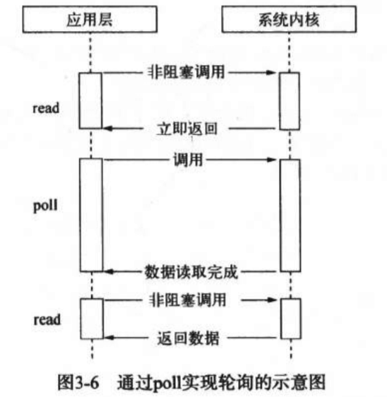
- epoll：在进行轮询的时候如果没有检查到I/O事件，将会进行休眠，直到事件发生将它唤醒。它是真实利用了事件通知、执行回调的方式，而不是遍历查询，所以不会浪费CPU，执行效率较高
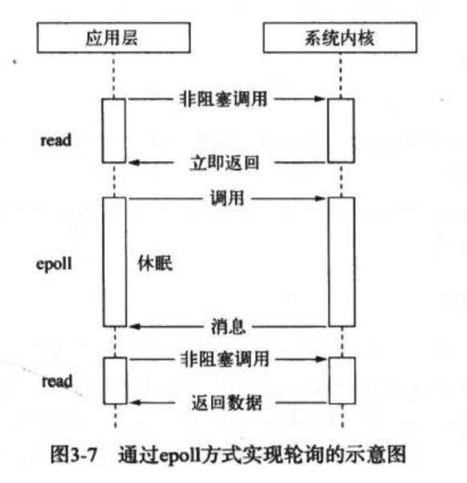

轮询技术满足了非阻塞I/O确保获取完整数据的需求，但它仍是一种同步

#### 理想的非阻塞异步I/O
应用程序发起非阻塞调用，无须通过遍历或者事件唤醒等方式轮询，可以直接处理下一个任务，只需在I/O完成后通过信号或回调将数据传递给应用程序即可
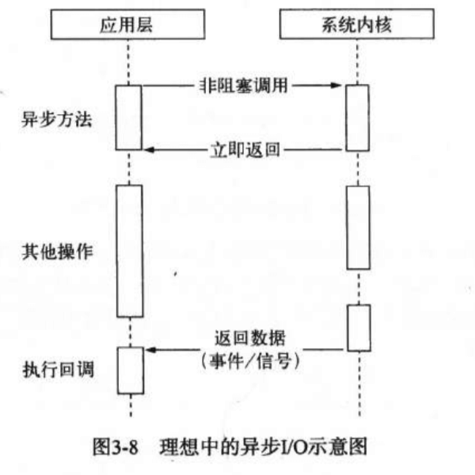

#### 现实的异步I/O
现实中采用多线程的方式，通过让部分线程进行阻塞I/O或者非阻塞I/0加轮询技术来完成数据获取，让另一个线程进行计算处理，通过线程之间的通信将I/O得到的数据进行传递

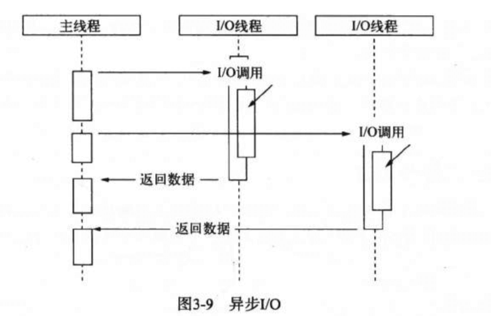

- *nix:自定义线程池
- windows:IOCP
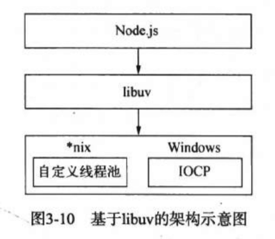

#### 事件循环
事件循环是一个典型的生产者/消费者模型。
异步I/O、网络请求等则是事件的生产者，源源不断为Node提供不同类型的事件，这些事件被传递到对应的观察者那里，事件循环则从观察者那里取出事件并处理
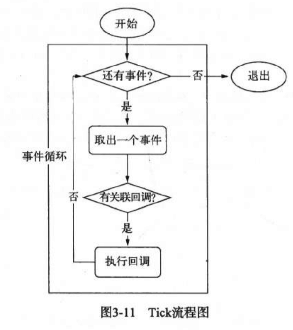

#### 处理过程（以fs.open()为例）
- js调用Node的核心模块，核心模块调用C++内建模块，内建模块调用了`uv_fs_open`方法,在`uv_fs_open()`的调用过程中，我们创建了一个FSReqWrap请求对象。从js层传入的参数和方法都被封装在这个请求对象中，其中回调函数被设置在这个对象的oncomplete_sym属性上，`req_wrap->object_->Set(oncomplete_sym,callback)`
- 对象包装完毕后，在Windows下，调用`QueueUserWorkItem()`方法将这个FSReqWrap对象堆入线程池中等待执行，`QueueUserWorkItem(&uv_fs_thread_proc,req,WT_EXECUTEDEFAULT)`，第一个参数是方法的引用，第二个参数是`uv_fs_thread_proc`方法运行时所需要的参数，第三个参数是执行的标志，当线程池中有可用线程时，我们会调用`uv_fs_thread_proc()`方法,至此，异步调用的第一阶段结束
- 当线程池中的I/O操作调用完毕，会将获取的结果储存在`req->result`属性上，然后调用`PostQueueCompletionStatus()`通知IOCP，告知当前对象操作已经完成,并将线程归还线程池。通过`PostQueueCompletionStatus()`方法提交的状态，可以通过`GetQueueCompletionStatus()`提取
- 事件循环的I/O观察者，在每次Tick的执行中，它会调用IOCP相关的`GetQueuedCompletionStatus()`方法检查线程池中是否有执行完的请求，如果存在，会将请求对象加入到I/O观察者的队列中，然后将其当做事件处理
- I/O观察者回调函数的行为就是取出请求对象的result属性作为参数，取出`oncomplete_sym`属性作为方法，然后调用执行，以此达到调用js中传入的回调函数的目的

#### 非I/O的异步API
- setTimeout,setInterval
- process.nextTick()：立即异步执行一个任务
- setImmediate()：与`process.nextTick()`类似，不过优先级低于`process.nextTick()`
- `process.nextTick()`的回调函数保存在一个数组中，`setImmediate()`的结果则是保存在链表中
- `process.nextTick()`在每轮循环中会将数组中的回调函数全部执行，`setImmediate()`在每轮循环中执行链表中的一个回调函数
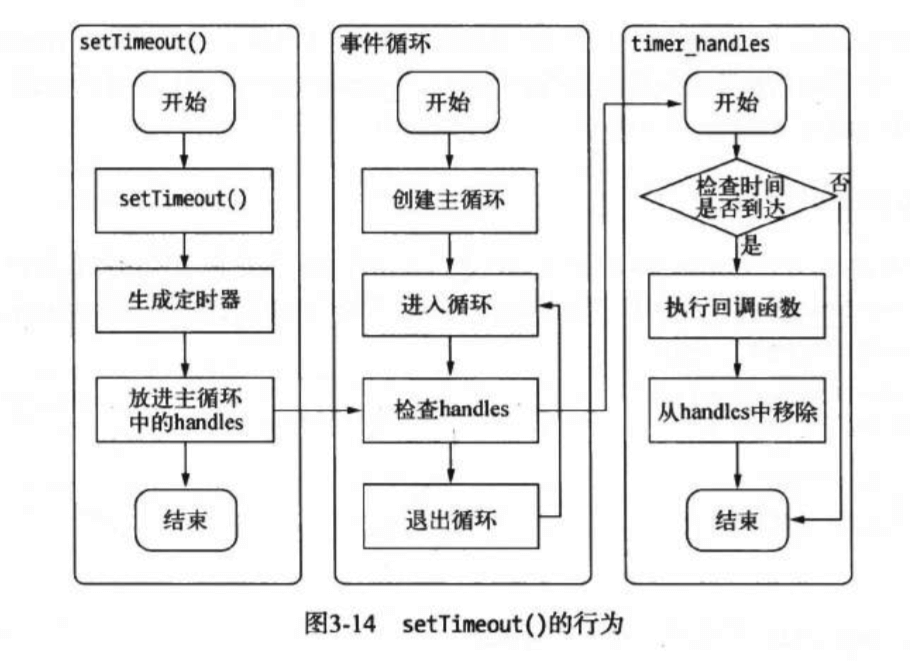

#### 事件驱动与高性能服务器
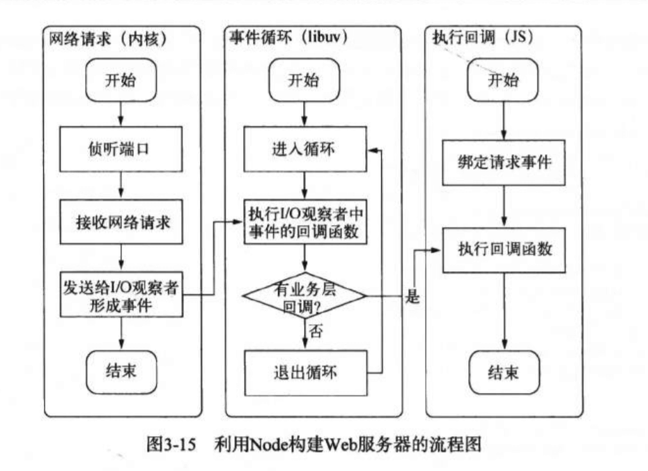

