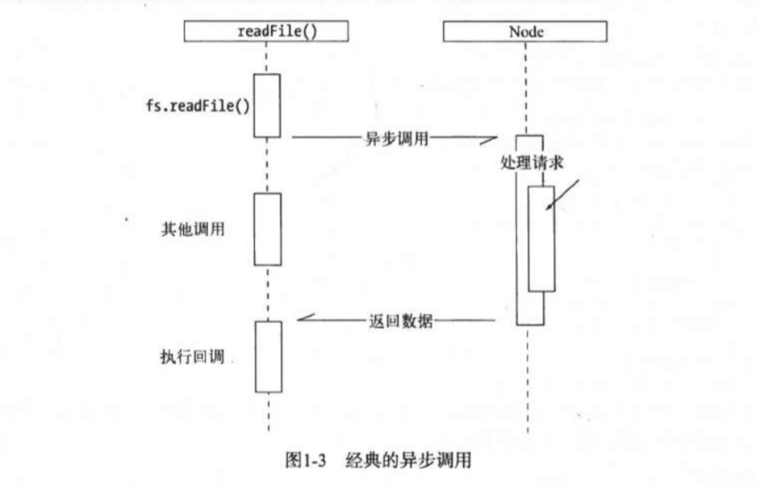
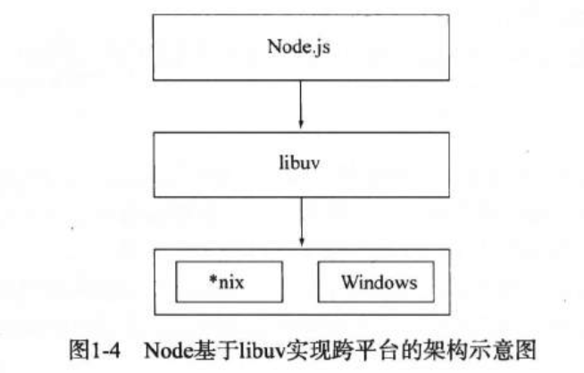

### 深入浅出Node.js

##### node的特点 
1. 异步I/O 
2. 事件与回调函数
3. 单线程
   - 缺点
      1. 无法利用多核CPU  
      2. 错误会引起整个应用退出，应用的健壮性值得考验
      3. 大量计算占用CPU，导致无法继续调用异步I/O
4. 跨平台：基于libuv在Node上层模块系统与操作系统之间构建了一层平台层架构 

##### 笔记
1. [模块机制](./module.md)

