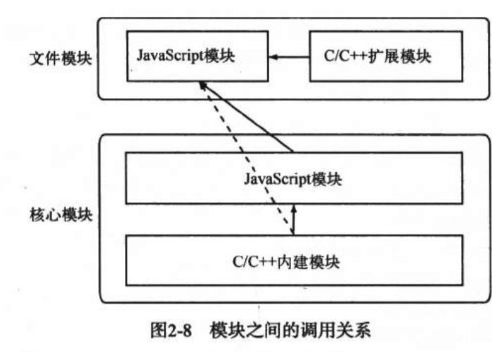

### 模块机制

#### CommonJS的模块规范
- 模块引用：通过`require()`方法引用
- 模块定义：上下文提供了`exports`对象用于导出当前模块的方法和变量，并且它是唯一导出的出口。
   在模块中，还存在一个`module`对象，它代表模块本身，而exports是module属性
- 模块标识：传递给`require()`方法的参数，必须是符合小驼峰命名的字符串，或者相对路径、绝对路径
``` javascript
// math.js
exports.add = function (i, j) {
  return i + j
}

// promgram.js
const math = require('math')
exports.increment = function (val) {
  return math.add(val, 1)
} 
```
   
#### Node的模块实现
- 在Node中，模块分为两类：
   1. 核心模块：Node提供的模块
   2. 文件模块：用户编写的模块

- Node模块加载的步骤
   1. 路径分析
   2. 文件定位
   3. 编译执行

- 模块的加载顺序
   1. 缓存加载：Node对引入过的模块都会进行缓存（编译和执行之后的对象），以减少二次引入时的开销，且核心模块的缓存检查先于文件模块的缓存检查
   2. 部分核心模块：Node进程启动时，部分核心模块就被直接加载进内存中，所以这部分核心模块引入时，忽略文件定位和编译，并且在路径分析中优先判断，所以加载速度是最快的
   3. 文件模块：动态加载，需要完整的加载步骤

#### 模块加载过程
- 路径分析
   1. 模块标识符分析，分为下面几类
      - 核心模块：如http、fs、path，直接加载
      - 路径形式的文件模块：`require`方法将路径转为真实路径，并以真实路径作为索引
      - 非路径形式的文件模块：
         1. 当前文件目录下的`node_modules`目录
         2. 父目录的`node_modules`目录
         3. 父目录的父目录下的`node_modules`目录
         4. 沿路径向上逐级递归，直到根目录下的`node_modules`目录

- 文件定位
   1. 文件扩展名分析：若不包含文件扩展名，Node按.js、.node、.json的次序补足扩展名，依次尝试
   2. 目录分析和包：
      - 若加上后缀名后直接找到文件，则返回
      - 在当前目录下查找`package.json`，通过`JSON.parse()`解析出包描述对象，从中取出`main`属性指定的文件名进行定位
      - 若第二步失败，Node会将index当做默认文件名
      - 若当前目录没有定位到文件，则进入下一个模块路径进行查找，直到路径数组遍历完毕，依然没有找到，则抛出异常

- 模块编译
   每一个编译成功的模块都会将其文件路径作为索引缓存在`Module._cache`对象上
   1. .js文件：通过fs模块同步读取文件后编译执行
      - 在编译的过程中，Node对获取的js文件内容会进行头尾包装
      - 包装之后的代码会通过vm原生模块的`runInThisContext()`方法执行，返回一个具体的function对象
      - 将参数传递给这个function执行，执行之后，模块的exports属性被返回给了调用方，exports属性上的任何方法和属性都可以被外部调用到
      - 由于exports对象是通过参数的方式传入的，直接赋值形参会改变形参的引用，但不能改变作用域外的值，所以要达到`require`引入一个类的效果，请赋值给`module.exports`对象

      
```javascript
(function (exports, require, module, __filename, __dirname) {
  var math = require('math')
  exports.area = function (radius) {
    return Math.PI * radius * radius
  }
})
```
   2. .node文件：C/C++编写的扩展文件，Node调用`process.dlopen`方法进行加载和执行，`dlopen()`在Windows和*nix平台有不同的实现，通过libuv兼容层进行了封装
   3. .json文件：Node利用fs模块同步读取JSON文件的内容之后，调用JSON.parse()方法得到对象，然后将它赋给模块对象的exports，以供外部调用
   4. 其他文件：它们都被当做.js文件载入

#### 模块调用栈


#### AMD,CMD
- AMD：异步加载，不管是否调用模块，先解析所有模块，速度快，有可能浪费资源
- CMD：异步加载，真正需要使用(依赖)模块时才解析该模块，按需解析，性能比AMD差


   
   