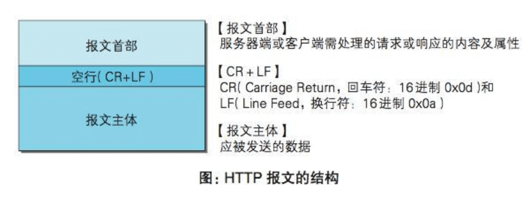
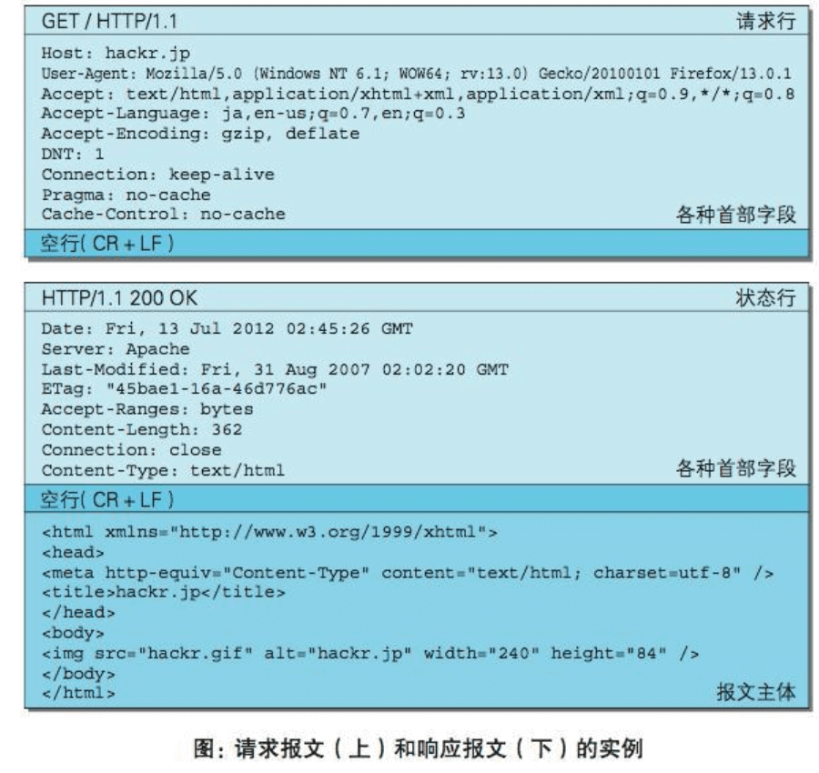
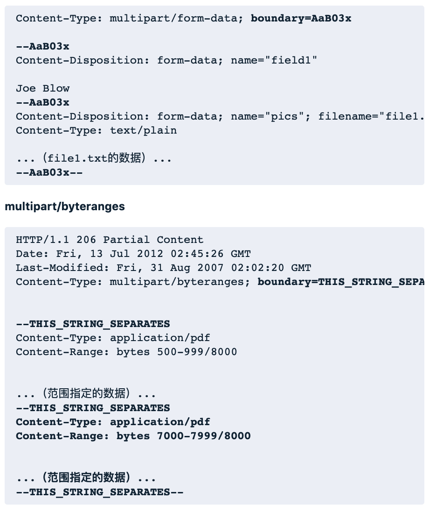

### HTTP报文内的HTTP信息
#### HTTP报文（HTTP协议交互的信息）
- 是由多行（用CR+LF作换行符）数据构成的字符串文本
- 请求端的HTTP报文叫做请求报文
- 响应端的报文叫做响应报文

#### 报文头部的组成

- 请求行：包含用于请求的方法，请求URI和HTTP版本
- 状态行：包含表明响应结果的状态码，原因短语和HTTP版本
- 首部字段：包含表示请求和响应的各种条件和属性的各类首部，一般分为4种，通用首部、请求首部、响应首部和实体首部
- 其他：可能包含HTTP的RFC里未定义的首部（Cookie等）

#### 内容编码
- HTTP在传输数据时，可以按照数据原貌直接传输，但也可以在传输过程中通过编码提升传输速率
- 通过在传输时编码，能有效地处理大量的访问请求

报文主体：是HTTP通信中的基本单位，由8位组字节流组成，通过HTTP通信传输

实体主体：作为请求或响应的有效载荷数据被传输，其内容由实体首部和实体主体组成

报文的作用用于传输请求或响应的实体主体，未发生内容编码时，报文主体等于实体主体，只有当传输中进行编码操作时，实体主体不等于报文主体

- 内容编码指明应用在实体内容上的编码格式，并保持实体信息原样压缩。内容编码后的实体由客户端接收并负责解码，常用的内容编码有以下几种：
1. gzip(GNU zip)
2. compress(UNIX 系统的标准压缩)
3. deflate(zlib)
4. identity(不进行编码)

#### 分割发送（通过把数据分割成多块，能够让浏览器逐步显示页面）
- 分块传输编码会将实体主体分成多个部分（块）。每一块都会用十六进制来标记块的大小，而实体主体的最后一块会使用 [0(CR+LF)] 来标记
- 使用分块传输编码的实体主体会由接收的客户端负责解码，恢复到编码前的实体主体

#### 多部分集合（发送的一份报文主体内可含有多类型实体）
multipart/form-data:在Web表单文件上传时使用
multipart/byteranges:状态码206（部分内容）响应报文包含了多个范围的内容时使用

- 在HTTP报文中使用多部分对象集合时，需要在首部字段里加上Content-type
- 使用boundary字符串来划分多部分对象集合指明的各类实体。在boundary字符串指定的各个实体的起始行开头，最后行开头结尾插入[--]标记
- 多部分对象集合的每个部分类型中，都可以含有首部字段
- 可以在某个部分中嵌套使用多部分对象集合

#### 范围请求
- 通过首部字段Range来指定资源的byte范围
- 针对范围请求，响应会返回状态码为206 Partial Content的响应报文。
- 对于多重范围的范围请求，响应会在首部字段Content-Type标明multipart/byteranges后返回响应报文
- 如果服务器端无法响应范围请求，则会返回状态码200 OK和完整的实体内容

#### 内容协商
- 客户端和服务端就响应的资源内容进行交涉，然后提供给客户端最为适合的资源
- 内容协商会以响应资源的语言、字符集、编码方式等作为判断的基准

服务器驱动协商：以请求的首部字段为参考，在服务器端自动处理。以浏览器发送的信息作为判定的依据

客户端驱动协商：由客户端进行内容协商的方式。用户从浏览器显示的可选项列表中手动选择，还可以利用JavaScript脚本在Web页面上自动进行上述选择

透明协商：服务器驱动和客户端驱动的结合体

