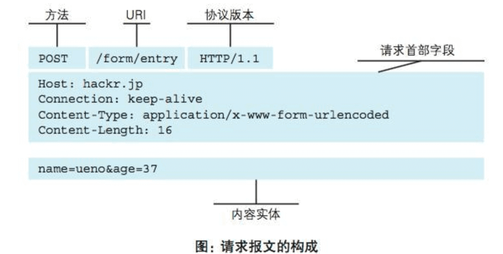
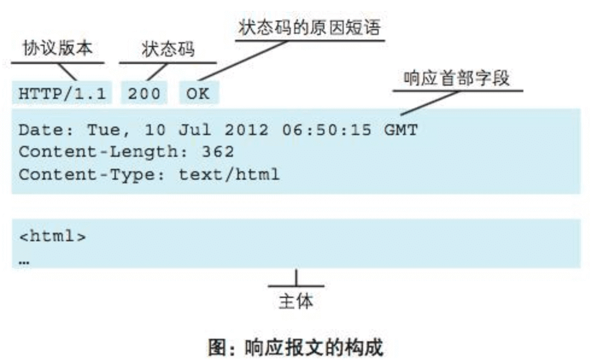

### HTTP协议
#### HTTP协议用于客户端和服务器端之间的通信
- 请求访问文本或图像等资源的一端称为客户端，而提供资源响应的一端称为服务器端
- 在两台计算机之间使用HTTP协议通信时，在一条通信线路上必定有一端是客户端，另一端则是服务器端

#### 通过请求和响应
HTTP协议规定，请求从客户端发起，最后服务端响应该请求并返回

#### HTTP是不保存状态的协议
- HTTP协议自身不对请求和响应之间的通信状态进行保存。也就是说在HTTP这个级别，协议对于发送过的请求或响应都不做持久化处理
- 每当有新的请求发送时，就会用对应的新响应产生。这是为了更快地处理大量事务，确保协议的可伸缩性，而特意把HTTP协议设计成如此简单的

#### 请求URI定位资源
- HTTP协议使用URI定位互联网上的资源。正是因为URI的特定功能，在互联网上任意位置的资源都能访问到
- 当客户端请求访问资源而发送请求时，URI需要将作为请求报文中的请求URI包含在内
- 如果不是访问特定资源而是对服务器本身发起请求，可以用一个*来代替请求URI

#### 使用方法下达命令
- GET：用来请求访问已被URI识别的资源，指定的资源经服务器端解析后返回响应内容
- POST：用来实体主体
- PUT：传输文件，要求在请求报文的主体中包含文件内容，然后保存到请求URI指定的位置
- HEAD：获得报文首部，与GET方法一样，只是不返回报文主体部分，用于确认URI的有效性及资源更新的日期时间等
- DELETE：删除文件，是于PUT相反的方法。DELETE方法按请求URI删除指定的资源
- OPTIONS：查询针对请求URI指定的资源支持的方法
- TRACE：发送请求时，在Max-Forwards首部字段中填入数值，每经过一个服务器端就将该数字减1，当数值刚好减到0时，就停止继续传输，最后接收到请求的服务器端则返回状态码200 OK的响应，客户端通过TRACE方法可以查询发送出去的请求是怎样被加工修改/篡改的
- CONNECT：要求在与代理服务器通信时建立隧道，实现用隧道协议进行TCP通信。主要使用SSL（Secure Sockets Layer 安全套接层）和TLS（Transport Layer Security 传输层安全）协议把通信内容加密后经网络隧道传输
`CONNECT 代理服务器名:端口号 HTTP版本`

#### 持久连接节省通信量
- 在HTTP协议的初始版本中，每进行一次HTTP通信就会断开一次TCP连接，因此，每次的请求都会造成无谓的TCP连接建立和断开，增加通信量的开销
- 为解决上述TCP连接的问题，HTTP/1.1和一部分的HTTP/1.0想出了持久连接的方法。持久连接的特点是，只要任意一端没有明确提出断开连接，则保持TCP连接状态
- 持久连接的好处在于减少了TCP连接的重复建立和断开所造成的额外开销，减轻了服务器端负载。另外，减少开销的那部分时间，使HTTP请求和响应能够更早地结束，这样Web页面的显示速度也就相应提高了
- 在HTTP/1.1中，所有的连接默认都是持久连接

管线化（pipelinling）：可以同时并行发送多个请求，但是连接中发送的多个请求还是会顺序处理

#### 使用Cookie的状态管理
- 通过在请求和响应报文中写入Cookie信息来控制客户端的状态
- Cookie会根据从服务器端发送的响应报文内的一个叫做Set-Cookie的首部字段信息，通知客户端保存Cookie。当下次客户端再次往该服务器发送请求时，客户端会自动在请求报文中加入Cookie值后发送出去
- 服务器端发现客户端发送过来的Cookie后，回去检查究竟是从哪一个客户端发来的连接请求，然后对比服务器上的记录，最后得到之前的状态信息
