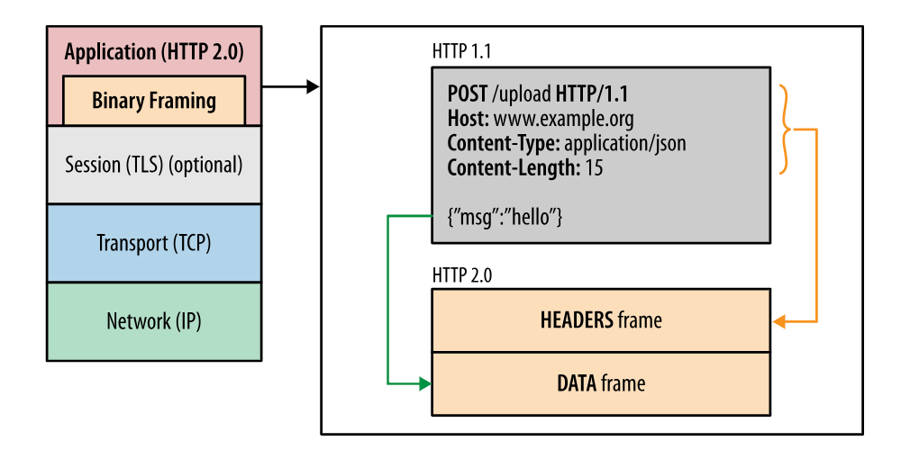
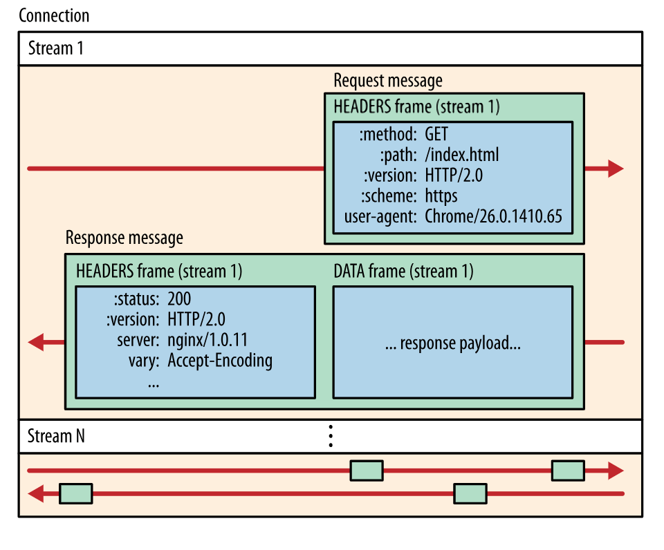
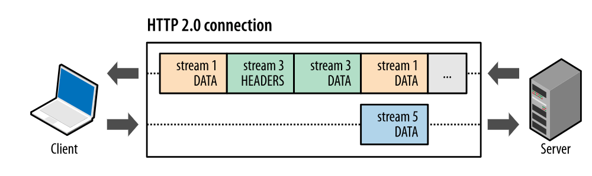
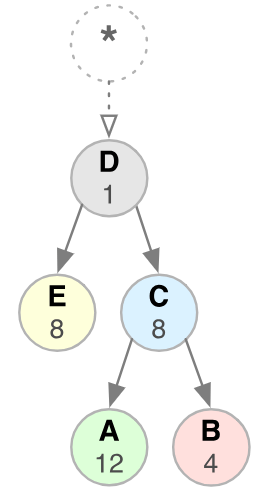
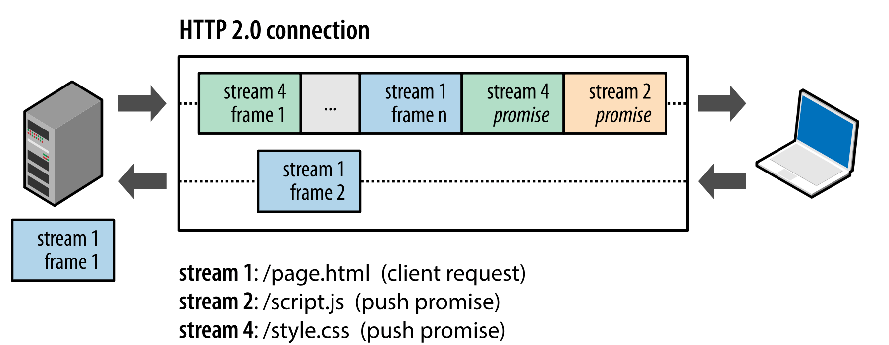
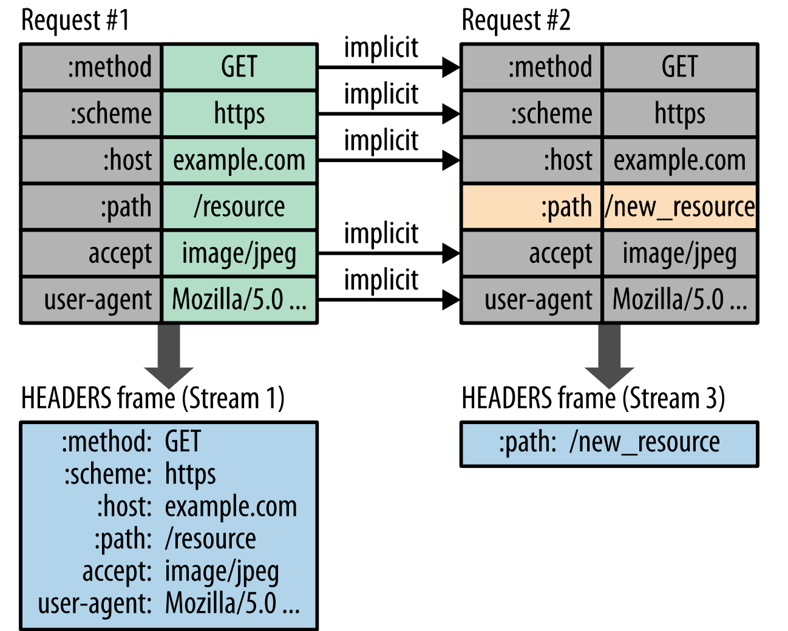

### HTTP2.0
#### HTTP的瓶颈
- 一条连接只可发送一个请求
- 若复用一个TCP连接，会导致队首阻塞，若需要并行处理，则必须需要多个TCP连接，造成资源浪费
- 请求只能从客户端开始。客户端不可以接收除响应以外的指令
- 请求/响应首部未经压缩就发送。首部信息越多延迟越大
- 发送冗长的首部。每次互相发送相同的首部造成的浪费较多
- 可任意选择数据压缩格式。非强制压缩发送

#### SPDY协议
- SPDY没有完全改写HTTP协议，而是在TCP/TP的应用层与传输层之间通过新加会话层的形式运作。同事，考虑到安全性问题，SPDY规定通信中使用SSL
- SPDY以会话层的形式加入，控制对数据的流动，但还是采用HTTP建立通信连接，因此，可照常使用HTTP的GET和POST等方法、Cookie以及HTTP报文等

- 功能
  - 多路复用流
  - 赋予请求优先级
  - 压缩HTTP首部
  - 推送功能
  - 服务器提示功能

#### HTTP2.0
- HTTP2是基于HTTP1.1的扩展，主要目标是通过支持完整的请求与响应复用来减少延迟，通过有效压缩 HTTP 标头字段将协议开销降至最低，同时增加对请求优先级和服务器推送的支持
- 为达成这些目标，HTTP/2带来了大量其他协议层面的辅助实现，例如新的流控制、错误处理和升级机制

##### 二进制分帧层
- HTTP2采用了新的二进制分帧层，将所有传输的信息分割为更小的消息和帧，并采用二进制格式对它们编码。这些帧对应着特定数据流中的消息。所有这些都在一个 TCP 连接内复用。 这是 HTTP/2 协议所有其他功能和性能优化的基础

##### HTTP2.0 的连接过程
- 数据流：已建立的连接内的双向字节流，可以承载一条或多条消息。
- 消息：与逻辑请求或响应消息对应的完整的一系列帧。
- 帧：HTTP/2 通信的最小单位，每个帧都包含帧头，会标识出当前帧所属的数据流

1. 所有通信都在一个 TCP 连接上完成，此连接可以承载任意数量的双向数据流
2. 每个数据流都有一个唯一的标识符和可选的优先级信息，用于承载双向消息
3. 每条消息都是一条逻辑 HTTP 消息（例如请求或响应），包含一个或多个帧
4. 帧是最小的通信单位，承载着特定类型的数据，例如 HTTP 标头、消息负载等等。 来自不同数据流的帧可以交错发送，然后再根据每个帧头的数据流标识符重新组装

##### 请求与响应复用
- 在 HTTP2.0 中，通过新的二进制分帧层，可以实现完整的请求和响应复用：客户端和服务器可以将 HTTP 消息分解为互不依赖的帧，然后交错发送，最后再在另一端把它们重新组装起来

如上图， 客户端正在向服务器传输一个 DATA 帧（数据流 5），与此同时，服务器正向客户端交错发送数据流 1 和数据流 3 的一系列帧。因此，一个连接上同时有三个并行数据流

##### 数据流优先级
- HTTP/2 标准允许每个数据流都有一个关联的权重和依赖关系：
  - 可以向每个数据流分配一个介于 1 至 256 之间的整数
  - 每个数据流与其他数据流之间可以存在显式依赖关系

- 数据流依赖关系和权重的组合让客户端可以构建和传递“优先级树”，表明它倾向于如何接收响应 
- 服务器可以使用此信息通过控制 CPU、内存和其他资源的分配设定数据流处理的优先级，在资源数据可用之后，带宽分配可以确保将高优先级响应以最优方式传输至客户端
- HTTP/2 协议还允许客户端随时更新这些优先级，进一步优化了浏览器性能
- 优先级并不是要求，因此不能保证特定的处理或传输顺序

- 优先级算法
  - 不同级时，先向父数据流分配资源，然后再向其依赖项分配资源
  - 共享相同父项的数据流同级时，应按其权重比例分配资源

如图，数据流 D 应先于 E 和 C 获得完整资源分配；E 和 C 应先于 A 和 B 获得相同的资源分配；A 和 B 应基于其权重获得比例分配

##### 复用一个 TCP 连接
- 所有 HTTP/2 连接都是永久的，而且仅需要每个来源一个连接，随之带来诸多性能优势
- 大多数 HTTP 传输都是短暂且急促的，而 TCP 则针对长时间的批量数据传输进行了优化。 通过重用相同的连接，HTTP/2 既可以更有效地利用每个 TCP 连接，也可以显著降低整体协议开销

##### 流控制
- 流控制是一种阻止发送方向接收方发送大量数据的机制，以免超出后者的需求或处理能力
- HTTP/2 提供了一组简单的构建块，这些构建块允许客户端和服务器实现其自己的数据流和连接级流控制

- 流控制的过程
  - 流控制具有方向性。 每个接收方都可以根据自身需要选择为每个数据流和整个连接设置任意的窗口大小
  - 流控制基于信用。 每个接收方都可以公布其初始连接和数据流流控制窗口（以字节为单位），每当发送方发出 DATA 帧时都会减小，在接收方发出 WINDOW_UPDATE 帧时增大
  - 流控制无法停用。 建立 HTTP/2 连接后，客户端将与服务器交换 SETTINGS 帧，这会在两个方向上设置流控制窗口。 流控制窗口的默认值设为 65,535 字节，但是接收方可以设置一个较大的最大窗口大小（2^31-1 字节），并在接收到任意数据时通过发送 WINDOW_UPDATE 帧来维持这一大小
  - 流控制为逐跃点控制，而非端到端控制。 即，可信中介可以使用它来控制资源使用，以及基于自身条件和启发式算法实现资源分配机制

##### 服务器推送
- 服务器可以主动向客户端推送额外资源，而无需客户端明确地请求
- 服务器推送的每个资源都是一个数据流，与内嵌资源不同，客户端可以对推送的资源逐一复用、设定优先级和处理
- 所有服务器推送数据流都由 PUSH_PROMISE 帧发起，表明了服务器向客户端推送所述资源的意图，并且需要先于请求推送资源的响应数据传输
- 在客户端接收到 PUSH_PROMISE 帧后，它可以根据自身情况选择拒绝数据流（通过 RST_STREAM 帧）
- 使用 HTTP/2，客户端仍然完全掌控服务器推送的使用方式。 客户端可以限制并行推送的数据流数量；调整初始的流控制窗口以控制在数据流首次打开时推送的数据量；或完全停用服务器推送

##### 标头压缩
- HTTP/2 使用 HPACK 压缩格式压缩请求和响应标头元数据
  - 这种格式支持通过静态 Huffman 代码对传输的标头字段进行编码，从而减小了各个传输的大小
  - 这种格式要求客户端和服务器同时维护和更新一个包含之前见过的标头字段的索引列表，此列表随后会用作参考，对之前传输的值进行有效编码

- HPACK 压缩上下文包含一个静态表和一个动态表
  - 静态表：静态表在规范中定义，并提供了一个包含所有连接都可能使用的常用 HTTP 标头字段（例如，有效标头名称）的列表
  - 动态表：动态表最初为空，将根据在特定连接内交换的值进行更新。 因此，为之前未见过的值采用静态 Huffman 编码，并替换每一侧静态表或动态表中已存在值的索引，可以减小每个请求的大小

