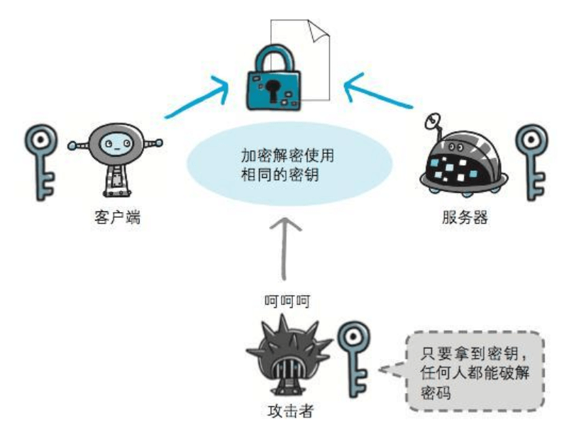

### HTTPS
#### HTTP的缺点
1. 通信使用明文（不加密），内容可能会被其窃听
2. 不验证通信方的身份，因此有可能遭遇伪装
3. 无法证明报文的完整性，所以有可能已遭篡改

#### HTTP + 加密 + 认证  = HTTPS
- HTTPS并非是应用层的一种新协议。只是HTTP通信接口部分用SSL（Secure Socket Layer）和TLS（Transport Layer Security）协议代替
- 在采用SSL后，HTTP就拥有了HTTPS的加密、证书和完整性保护这些功能
- SSL是独立于HTTP的协议，运行在应用层上的协议均可配合SSL协议使用

#### 共享密匙加密（对称密匙加密）
- 加密和解密公用一个密匙的方式




#### 公开密匙加密
- 使用一把非对称的密匙。一把叫做私有密匙，另一把叫做公开密匙
- 发送密文的一方使用对方的公开密匙进行加密处理，对方收到被加密的信息后，再使用自己的私有密匙进行解密


#### HTTPS采用混合加密机制
- 若密匙能够实现安全交换，那么有可能会考虑仅使用公开密匙加密来通信。但是公开密匙加密与共享密匙加密相比，其处理速度要慢
- 在交换密匙环节使用公开密匙加密方式，之后的建立通信交换报文阶段则使用共享密匙加密方式


#### 证明公开密匙正确性的证书
- 服务器的运营人员向数字证书认证机构提出公开密匙的申请
- 数字证书认证机构在判明提出申请者的身份之后，会对已申请的公开密匙做数字签名，然后分配这个已签名的公开密匙，并将该公开密匙放入公匙证书后绑定在一起
- 服务器会将这份由数字证书认证机构颁发的公匙证书发送给客户端，以进行公匙密匙加密方式通信
- 接到证书的客户端可使用数字证书认证机构的公开密匙，对那张证书上的数字签名进行验证，一旦验证通过，说明服务器的公开密匙是真实有效的数字证书认证机构，服务器的公开密匙是值得信赖的
- 多数浏览器开发商发布版本时，会事先在内部植入常用认证机关的公开密匙


#### HTTPS的安全通信机制
```
      client Hello(请求，SSL的指定版本、加密组件列表)  
客户端 ------------------------------------------> 服务器
      server Hello(应答，SSL的指定版本、加密组件列表)
      <------------------------------------------
                certificate(公开密匙证书)
      <------------------------------------------      
          server hello done(SSL握手协商部分结束)
      <------------------------------------------ 
      client key exchange(发送Pre-master secret的随机密码串)
      ------------------------------------------>   
      change cipher spec(提示服务器采用Pre-master secret密匙加密)
      ------------------------------------------>
            finished(整体校验值，协商是否能够成功)
      ------------------------------------------>
                change cipher spec(同客户端)
      <------------------------------------------
                    finished(同客户端)
      <------------------------------------------
                      发送HTTP请求
      <----------------------------------------->
```
- 在以上流程中，应用层发送数据时会附加一种叫做MAC的报文摘要，MAC能够查知报文是否遭到篡改，从而保护报文的完整性


