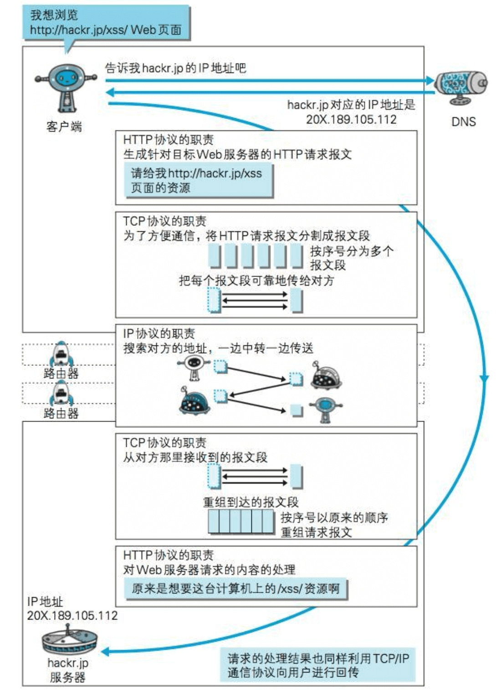

### IP、TCP和DNS
#### IP(Internet Protocol)
- IP网络协议位于网络层
- 作用是把各种数据包传送给对方。而要保证确实传送到对方那里，则需要满足各类条件，其中两个重要的条件是IP地址和MAC地址

IP地址：指明了节点被分配到的地址（可变换）
MAC地址：网卡所属的固定地址（不可变换）
IP地址可以和MAC地址进行配对

- IP间的通信依赖MAC地址。在网络上，通信的双方在同一局域网（LAN）内的情况是很少的，通常是经过多台计算机和网络设备中转才能连接到对方（路由选择）。而在进行中转时，会利用下一站中转设备的MAC地址来搜索下一个中转目标。这时，会采用ARP协议（Address Resolution Protocol）
ARP：一种解析地址的协议，根据通信方的IP地址就可以反查出对应的MAC地址

#### TCP
- TCP位于传输层，提供可靠（确保数据准确可靠地传给对方）的字节流服务（为了方便传输，将大块数据分割成以报文段为单位的数据包进行管理）
- 为了可靠的传输，TCP协议采用了三次握手策略，TCP协议把数据包送出去后，不会对传送后的情况置之不理，它一定会向对方确认是否成功送达。握手过程中使用了TCP的标志

三次握手
1. 发送端首先发送一个带SYN标志的数据包给对方
2. 接收端收到后，回传一个带有SYN/ACK标志的数据包以示传达确认信息
3. 最后，发送端再回传一个带ACK标志的数据包，代表【握手】结束
4. 若在握手过程中某个阶段莫名中断，TCP协议会再次以相同的顺序发送相同的数据包

#### DNS
- DNS服务是和HTTP协议一样位于应用层的协议。它提供域名到IP地址之间的解析服务
- 通过域名查找IP地址，或逆向从IP地址反查域名的服务

#### 各种协议与HTTP协议的关系

