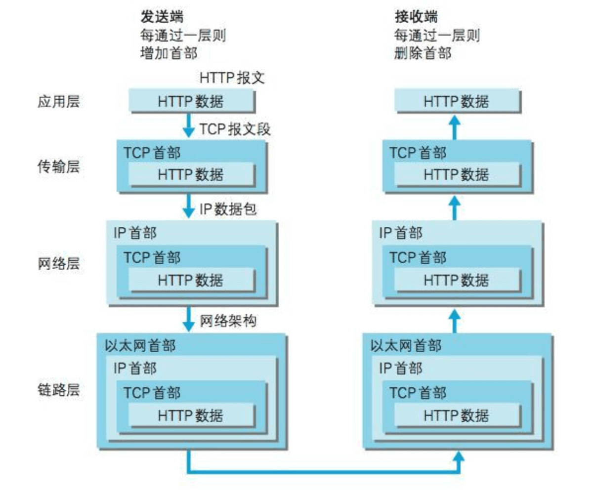

### 网络分层
#### 应用层
- 应用层决定了向用户提供应用服务时通信的活动
- HTTP协议也处于该层

#### 传输层
- 传输层对上层应用层，提供处于网络连接中的两台计算机之间的数据传输
- 包含两个性质不同的协议：
  - TCP(Transmission Control Protocol)：传输控制协议
  - UDP(User Data Protocol)：用户数据报协议

#### 网络层
- 网络层用来处理在网络上流动的数据包。数据包是网络传输的最小数据单位。该层规定了通过怎样的路径（所谓的传输路线）到达对方计算机，并把数据包传送给对方

#### 链路层
- 用来处理连接网络的硬件部分。包括控制操作系统、硬件的设备驱动、网卡，及光纤等物理可见部分（还包括连接器等一切传输媒介）。硬件上的范畴均在链路层的作用范围之内

️用HTTP举例说明网络分层：
1. 作为发送端的客户端在应用层（HTTP协议）发出一个想看某个Web页面的HTTP请求
2. 在传输层（TCP协议）把从应用层处收到的数据（HTTP请求报文）进行分割，并在各个报文上打上标记序号及端口号后转发给网络
3. 在网络层（IP协议），增加作为通信目的地的MAC地址后转发给链路层
4. 接收端的服务器在链路层接收到数据，按序往上层发送，一直到应用层。当传输到应用层，才能算真正接收到由客户端发送过来的HTTP请求

封装：把数据信息包装起来
- 在发送端，每经过一层时必定会被打上一个该层所属的首部信息
- 在接收端，每经过一层会把对应的首部消去