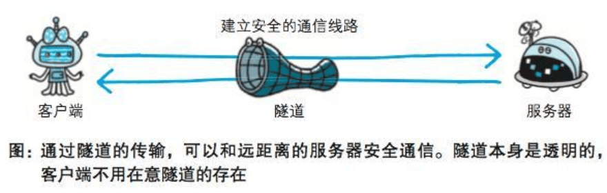

### 与HTTP协作的Web服务器
#### 用单台虚拟主机实现多个域名
- HTTP/1.1 规范允许一台HTTP服务器搭建多个Web站点
- 即时物理层面只有一台服务器，但只要使用虚拟主机的功能，则可以假想已具有多台服务器
- 在相同的IP地址下，由于虚拟主机可以寄存多个不同主机名和域名的Web网站，因此在发送HTTP请求时，必须在Host首部内完整指定主机名或域名的URI

#### 代理
- 接收客户端发送的请求后转发给其他服务器。代理不改变请求URI，会直接发送给前方持有资源的目标服务器
- 在HTTP通信过程中，可级联多台代理服务器。转发时，需要附加Via首部字段以标记出经过的主机信息
- 使用代理服务器的理由有：利用缓存技术减少网络带宽的流量，组织内部针对特定网站的访问控制，以获取访问日志为主要目的

缓存代理：代理转发响应时，缓存代理会预先将资源的副本（缓存）保存在代理服务器上。当代理再次接收到对相同资源的请求时，就可以不从源服务器那里获取资源，而是将之前缓存的资源作为响应返回

透明代理：转发请求或响应时，不对报文做任何加工的代理。对报文内容进行加工的代理称为非透明代理

#### 网关
- 网关的工作机制和代理十分相似。而网关能使通信线路上的服务器提供非HTTP协议服务

#### 隧道
- 隧道可按要求建立起一条与其他服务器的通信线路，确保客户端能与服务器进行安全的通信
- 隧道不会去解析HTTP请求，请求保持原样中转给之后的服务器，隧道会在通信双方断开连接时结束

